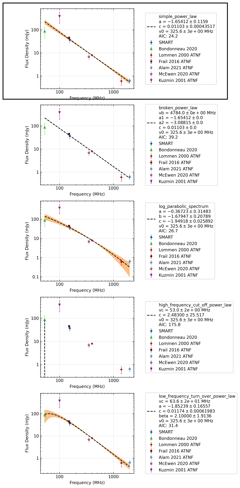

.. _J0030+0451:
J0030+0451
==========

Best Fit
--------
.. image:: best_fits/J0030+0451_simple_power_law_fit.png
  :width: 800

.. csv-table:: J0030+0451 fit results
   :header: "model","a","b"

   "simple_power_law","-1.64±0.12","0.00±0.00"

Fit Before MWA
--------------
.. image:: before_mwa/J0030+0451_simple_power_law_fit.png
  :width: 800

.. csv-table:: J0030+0451 before fit results
   :header: "model","a","b"

   "simple_power_law","-1.64±0.12","0.00±0.00"

Flux Density Results
--------------------
.. csv-table:: J0030+0451 flux density total results
   :header: "N obs", "Flux Density (mJy)", "u_S_mean", "u_scint", "m_r_v"

   "1",  "36.9±47.7", "8.3", "46.9", "1.272"

.. csv-table:: J0030+0451 flux density individual results
   :header: "ObsID", "Flux Density (mJy)"

    "1255444104", "36.9±8.3"

Comparison Fit
--------------

Detection Plots
---------------

.. image:: detection_plots/1255444104_J0030+0451.prepfold.png
  :width: 800

.. image:: on_pulse_plots/
  :width: 800