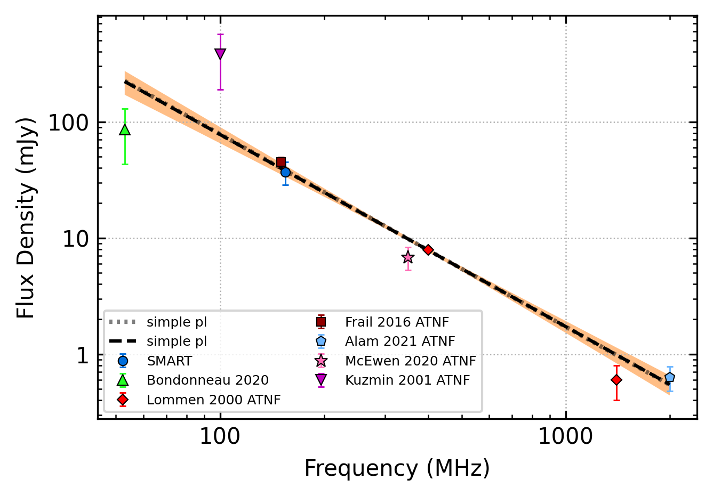

.. _J0030+0451:
J0030+0451
==========

Best Fit
--------

.. csv-table:: J0030+0451 fit results
   :header: "model","vpeak (MHz)","a","c","beta","v0 (MHz)"

   "low_frequency_turn_over_power_law","96±0","-8.00±0.74","8854.52±1448.13","0.39±0.00","324±3"

Fit Before MWA
--------------

.. csv-table:: J0030+0451 before fit results
   :header: "model","vpeak (MHz)","a","c","beta","v0 (MHz)"

   "low_frequency_turn_over_power_law","96±0","-8.00±0.78","8839.13±1458.02","0.39±0.00","324±3"

Flux Density Results
--------------------
.. csv-table:: J0030+0451 flux density total results
   :header: "N obs", "Flux Density (mJy)", "u_S_mean", "u_scint", "m_r_v"

   "1",  "36.9±47.7", "8.3", "46.9", "1.272"

.. csv-table:: J0030+0451 flux density individual results
   :header: "ObsID", "Flux Density (mJy)"

    "1255444104", "36.9±8.3"

Comparison Fit
--------------
.. image:: comparison_fits/J0030+0451_comparison_fit.png
  :width: 800

Detection Plots
---------------

.. image:: detection_plots/pf_1255444104_J0030+0451_00:30:27.42_+04:51:39.72_b49_4.87ms_Cand.pfd.png
  :width: 800

.. image:: on_pulse_plots/
  :width: 800