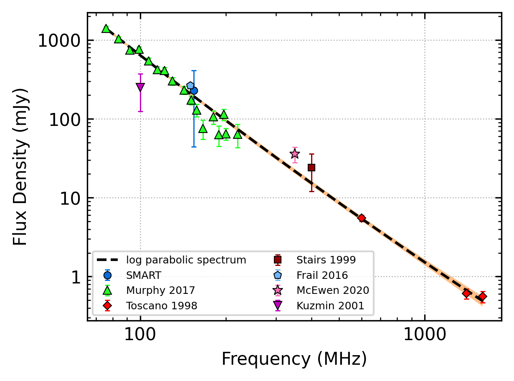
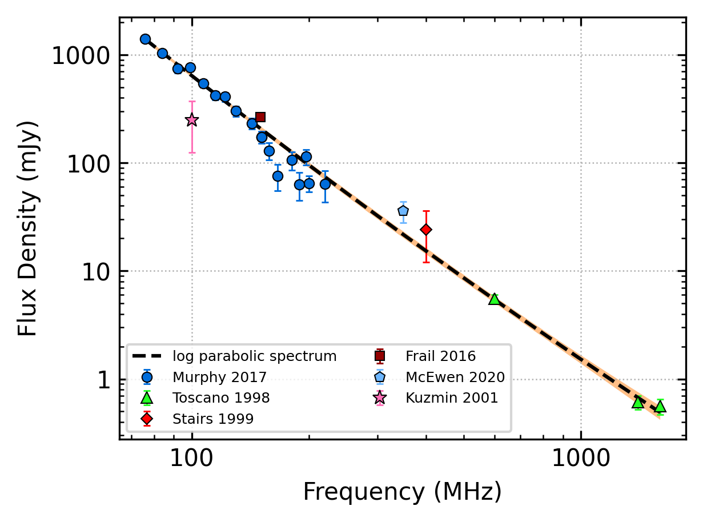

J0034-0534
==========

Best Fit
--------

.. csv-table:: J0034-0534 fit results
   :header: "model","a","b","c"

   "log_parabolic_spectrum","0.17±0.11","-2.41±0.16","-3.09±0.05"

Fit Before MWA
--------------

.. csv-table:: J0034-0534 before fit results
   :header: "model","a","b","c"

   "log_parabolic_spectrum","0.18±0.11","-2.41±0.16","-3.09±0.05"

Flux Density Results
--------------------
.. csv-table:: J0034-0534 flux density total results
   :header: "N obs", "Flux Density (mJy)", "u_S_mean", "u_scint", "m_r_v"

   "1",  "228.8±184.7", "74.5", "169.0", "0.739"

.. csv-table:: J0034-0534 flux density individual results
   :header: "ObsID", "Flux Density (mJy)"

    "1255444104", "228.8±74.5"

Comparison Fit
--------------
.. image:: comparison_fits/J0034-0534_comparison_fit.png
  :width: 800

Detection Plots
---------------

.. image:: detection_plots/1255444104_J0034-0534.prepfold.png
  :width: 800

.. image:: on_pulse_plots/
  :width: 800