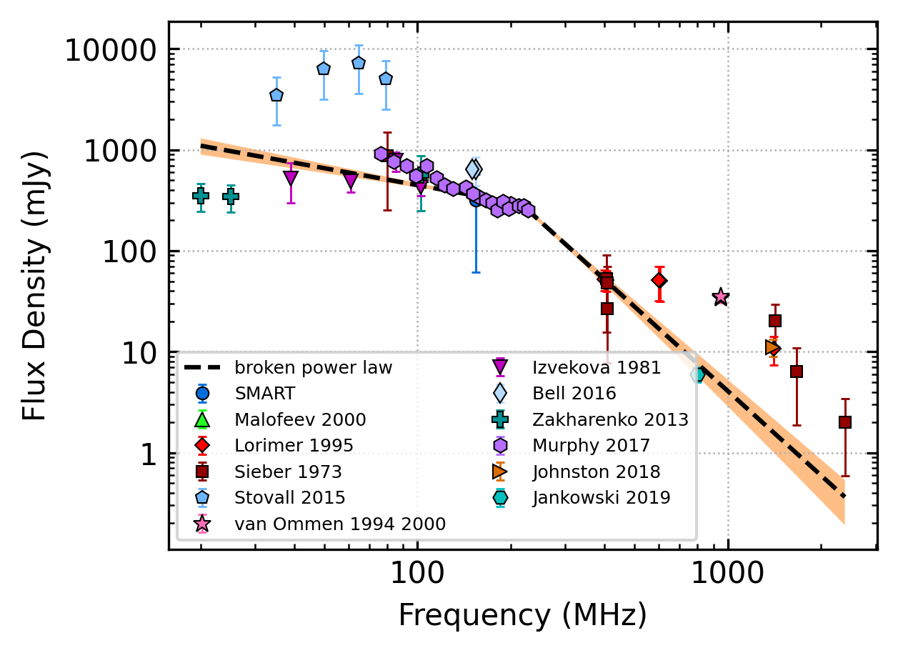
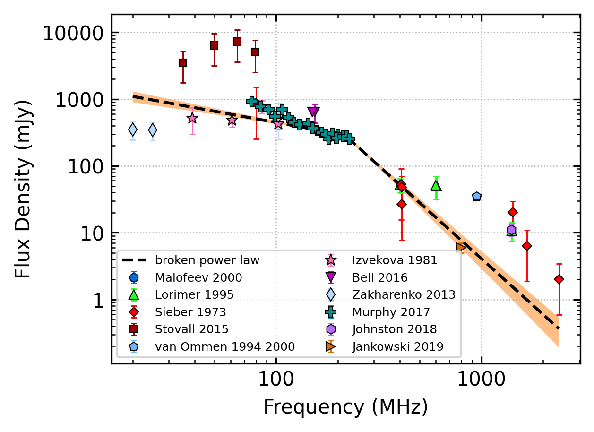
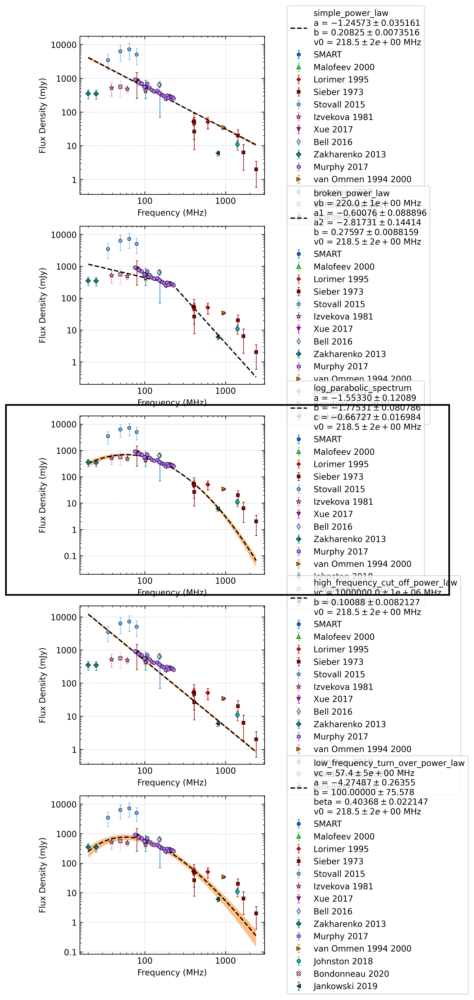
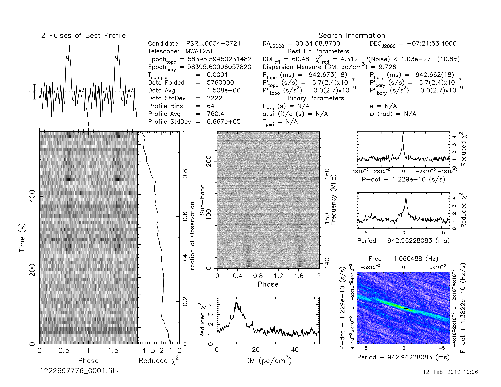
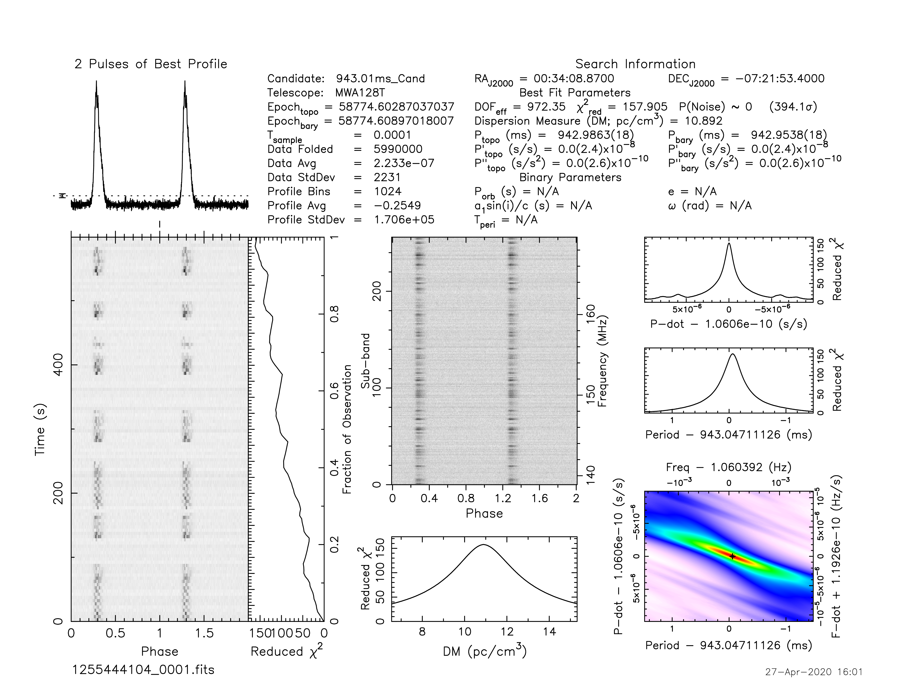
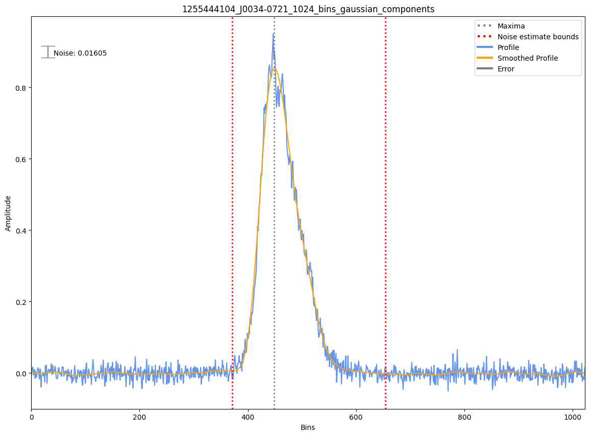

.. _J0034-0721:
J0034-0721
==========

Best Fit
--------

.. csv-table:: J0034-0721 fit results
   :header: "model","vb (MHz)","a1","a2","b"

   "broken_power_law","215±6","-0.56±0.09","-2.78±0.21","0.11±0.02"

Fit Before MWA
--------------

.. csv-table:: J0034-0721 before fit results
   :header: "model","vb (MHz)","a1","a2","b"

   "broken_power_law","215±6","-0.56±0.09","-2.78±0.21","0.11±0.02"

Flux Density Results
--------------------
.. csv-table:: J0034-0721 flux density total results
   :header: "N obs", "Flux Density (mJy)", "u_S_mean", "u_scint", "m_r_v"

   "2",  "316.3±254.6", "37.7", "260.5", "0.824"

.. csv-table:: J0034-0721 flux density individual results
   :header: "ObsID", "Flux Density (mJy)"

    "1222697776", "23.0±6.1"
    "1255444104", "609.5±37.2"

Comparison Fit
--------------

Detection Plots
---------------

.. image:: on_pulse_plots/1222697776_J0034-0721_64_bins_gaussian_components.png
  :width: 800

