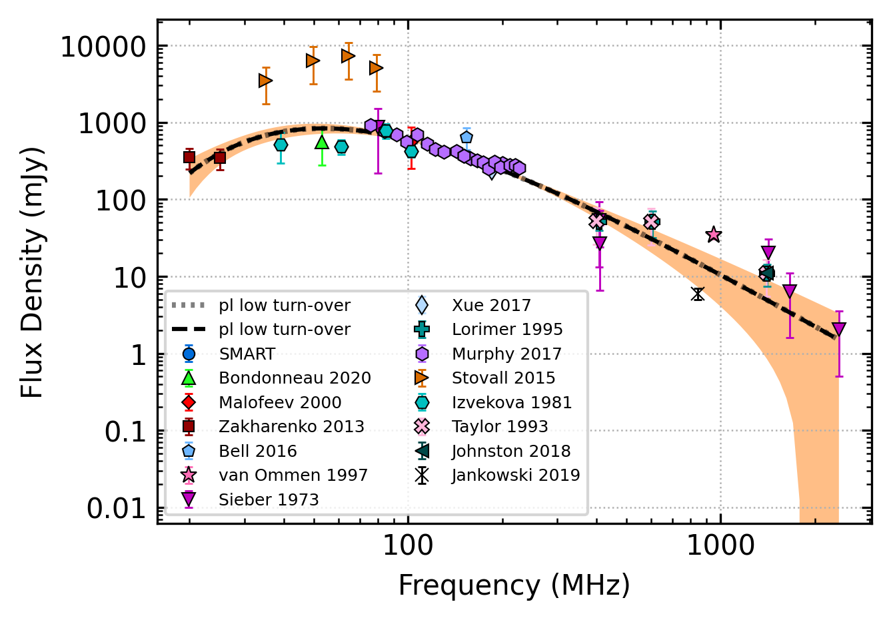

.. _J0034-0721:
J0034-0721
==========

Best Fit
--------

.. csv-table:: J0034-0721 fit results
   :header: "model","vc (MHz)","a","c","beta","v0 (MHz)"

   "low_frequency_turn_over_power_law","53±5","-2.36±0.97","0.47±0.73","0.86±0.54","218±2"

Fit Before MWA
--------------

.. csv-table:: J0034-0721 before fit results
   :header: "model","vc (MHz)","a","c","beta","v0 (MHz)"

   "low_frequency_turn_over_power_law","53±5","-2.35±0.95","0.46±0.70","0.86±0.53","218±2"

Flux Density Results
--------------------
.. csv-table:: J0034-0721 flux density total results
   :header: "N obs", "Flux Density (mJy)", "u_S_mean", "u_scint", "m_r_v"

   "2",  "359.1±289.0", "42.7", "295.7", "0.824"

.. csv-table:: J0034-0721 flux density individual results
   :header: "ObsID", "Flux Density (mJy)"

    "1222697776", "26.3±7.0"
    "1255444104", "691.9±42.1"

Comparison Fit
--------------
.. image:: comparison_fits/J0034-0721_comparison_fit.png
  :width: 800

Detection Plots
---------------

.. image:: on_pulse_plots/1222697776_J0034-0721_64_bins_gaussian_components.png
  :width: 800
.. image:: detection_plots/1255444104_J0034-0721.prepfold.png
  :width: 800

.. image:: on_pulse_plots/1255444104_J0034-0721_1024_bins_gaussian_components.png
  :width: 800