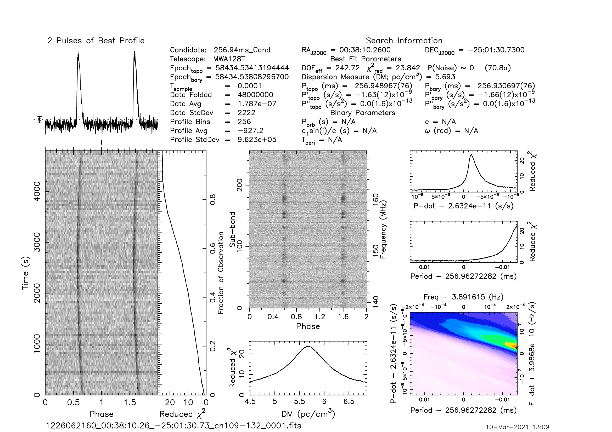
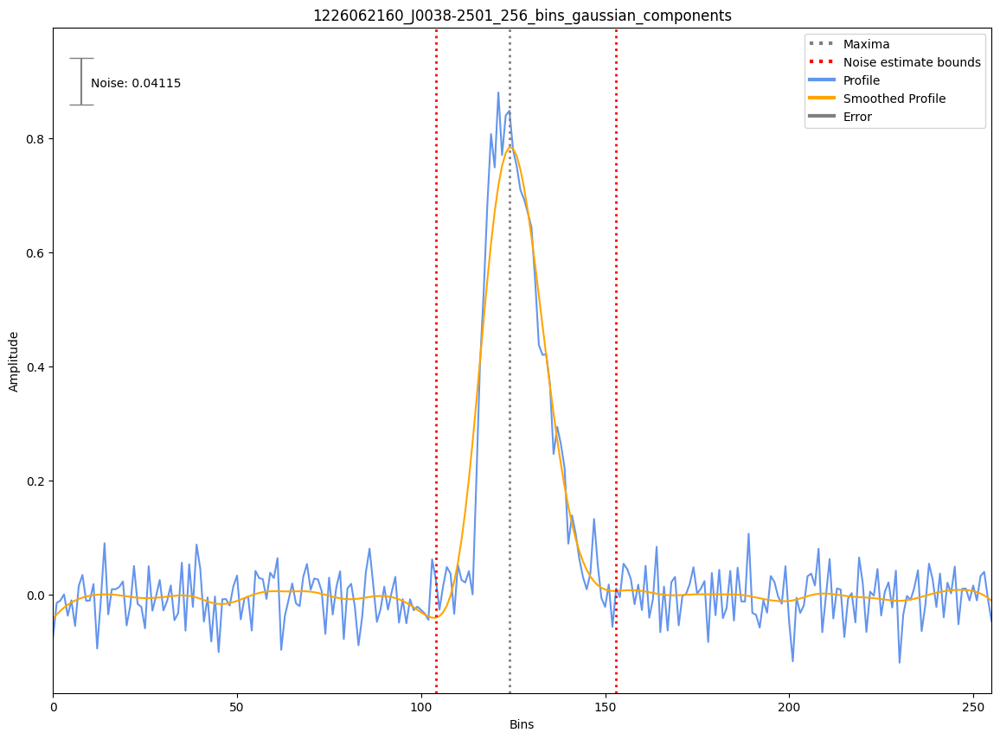

.. _J0038-2501:
J0038-2501
==========

Best Fit
--------
Only 1 MWA data and 1 cat data available

Flux Density Results
--------------------
.. csv-table:: J0038-2501 flux density total results
   :header: "N obs", "Flux Density (mJy)", "u_S_mean", "u_scint", "m_r_v"

   "1",  "44.3±49.8", "5.6", "49.5", "1.117"

.. csv-table:: J0038-2501 flux density individual results
   :header: "ObsID", "Flux Density (mJy)"

    "1226062160", "44.3±5.6"

Detection Plots
---------------

