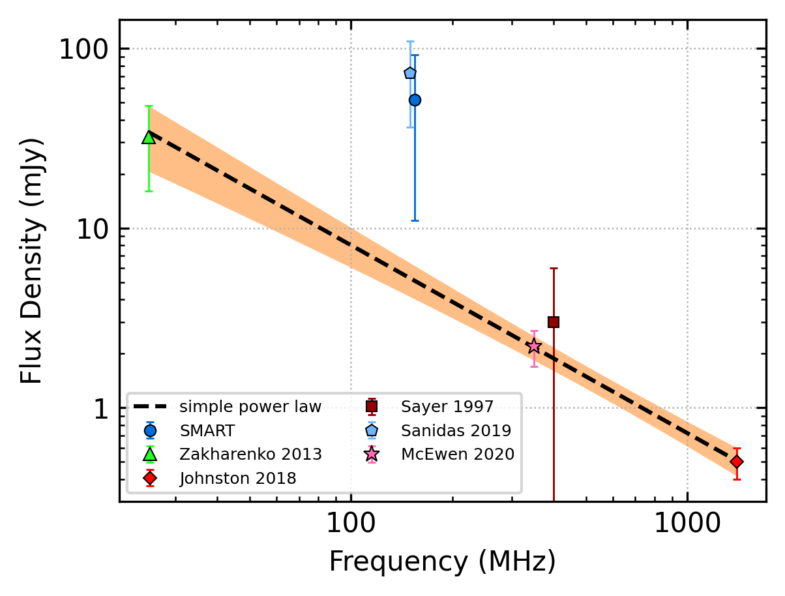
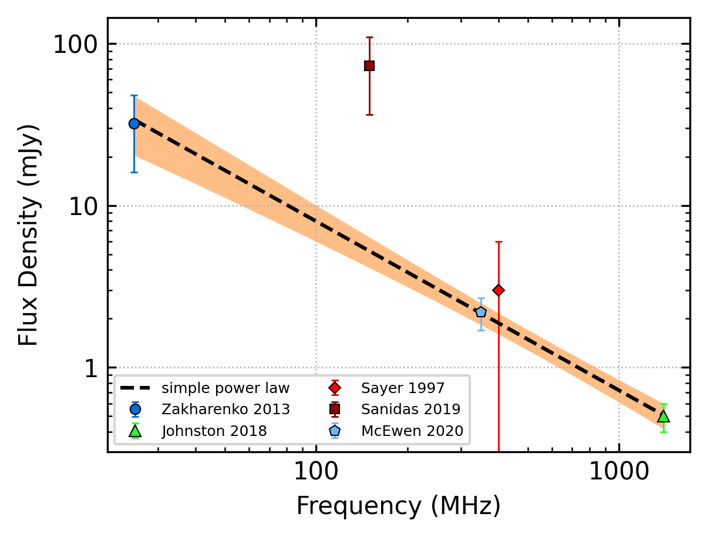

J0051+0423
==========

Best Fit
--------

.. csv-table:: J0051+0423 fit results
   :header: "model","a","b"

   "simple_power_law","-1.05±0.12","0.00±0.00"

Fit Before MWA
--------------

.. csv-table:: J0051+0423 before fit results
   :header: "model","a","b"

   "simple_power_law","-1.04±0.12","0.00±0.00"

Flux Density Results
--------------------
.. csv-table:: J0051+0423 flux density total results
   :header: "N obs", "Flux Density (mJy)", "u_S_mean", "u_scint", "m_r_v"

   "1",  "51.6±40.6", "14.6", "37.9", "0.735"

.. csv-table:: J0051+0423 flux density individual results
   :header: "ObsID", "Flux Density (mJy)"

    "1225118240", "51.6±14.6"

Comparison Fit
--------------
.. image:: comparison_fits/J0051+0423_comparison_fit.png
  :width: 800

Detection Plots
---------------

.. image:: detection_plots/1225118240_J0051+0423.prepfold.png
  :width: 800

.. image:: on_pulse_plots/1225118240_J0051+0423_64_bins_gaussian_components.png
  :width: 800