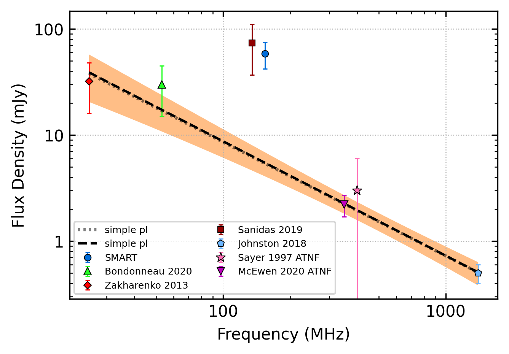
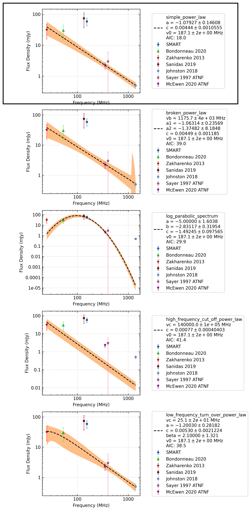

.. _J0051+0423:
J0051+0423
==========

Best Fit
--------

.. csv-table:: J0051+0423 fit results
   :header: "model","a","c","v0 (MHz)"

   "simple_power_law","-1.08±0.15","0.00±0.00","187±1"

Fit Before MWA
--------------

.. csv-table:: J0051+0423 before fit results
   :header: "model","a","c","v0 (MHz)"

   "simple_power_law","-1.09±0.15","0.00±0.00","184±1"

Flux Density Results
--------------------
.. csv-table:: J0051+0423 flux density total results
   :header: "N obs", "Flux Density (mJy)", "u_S_mean", "u_scint", "m_r_v"

   "1",  "58.7±46.2", "16.6", "43.1", "0.735"

.. csv-table:: J0051+0423 flux density individual results
   :header: "ObsID", "Flux Density (mJy)"

    "1225118240", "58.7±16.6"

Comparison Fit
--------------

Detection Plots
---------------

