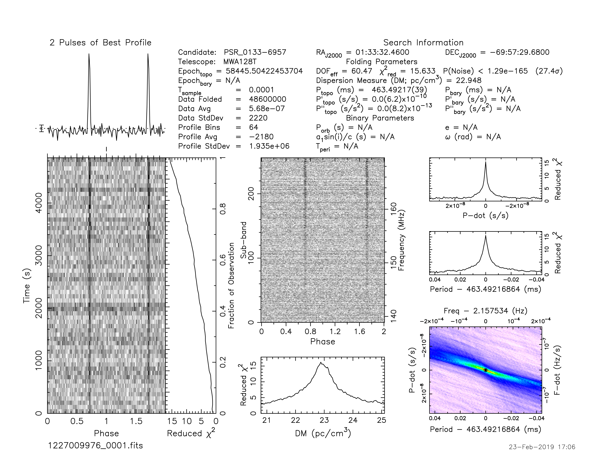
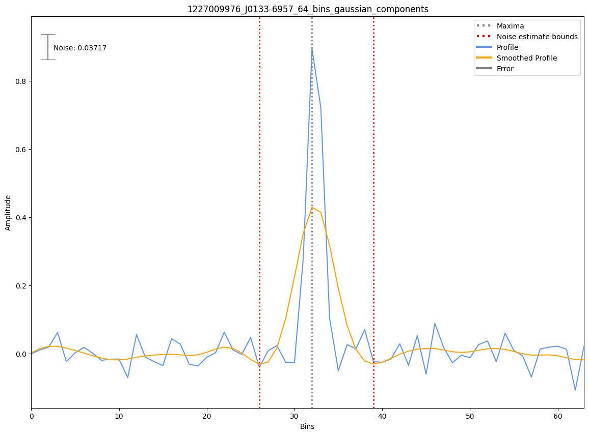

.. _J0133-6957:
J0133-6957
==========

Best Fit
--------
Only 1 MWA data and 2 cat data available

Flux Density Results
--------------------
.. csv-table:: J0133-6957 flux density total results
   :header: "N obs", "Flux Density (mJy)", "u_S_mean", "u_scint", "m_r_v"

   "1",  "12.1±8.0", "4.0", "7.0", "0.581"

.. csv-table:: J0133-6957 flux density individual results
   :header: "ObsID", "Flux Density (mJy)"

    "1227009976", "12.1±4.0"

Detection Plots
---------------

