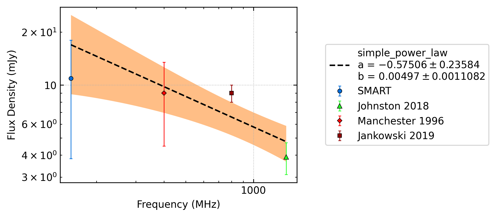
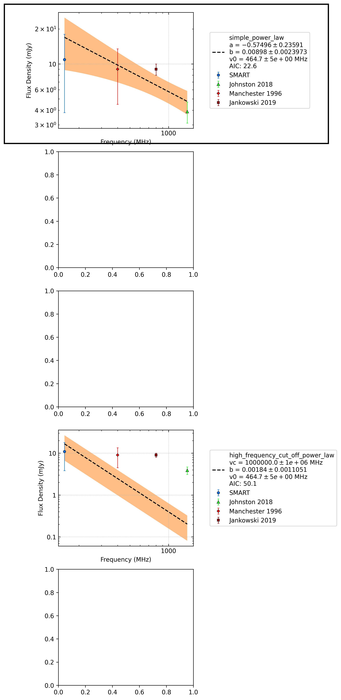
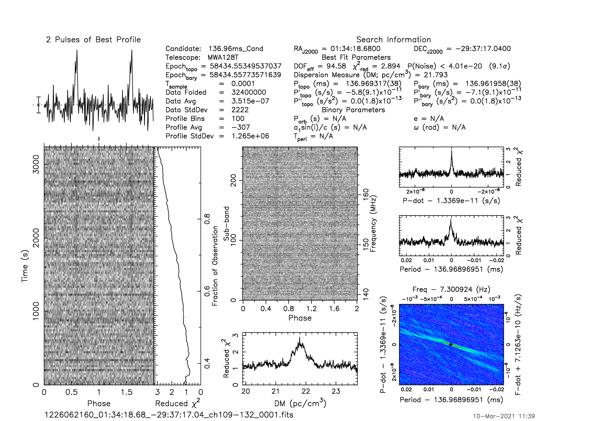
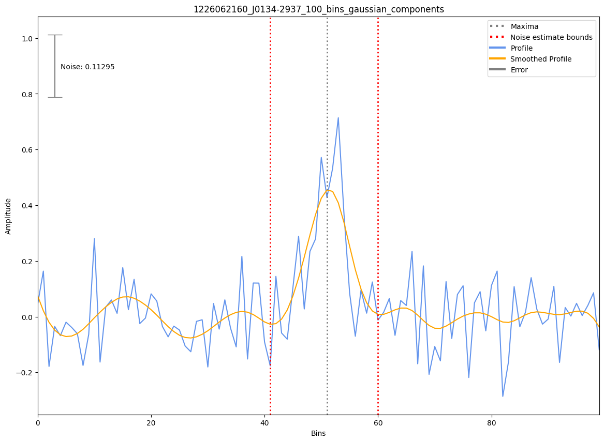

.. _J0134-2937:
J0134-2937
==========

Best Fit
--------

.. csv-table:: J0134-2937 fit results
   :header: "model","a","b","v0 (MHz)"

   "simple_power_law","-0.57±0.24","0.01±0.00","464±4"

Flux Density Results
--------------------
.. csv-table:: J0134-2937 flux density total results
   :header: "N obs", "Flux Density (mJy)", "u_S_mean", "u_scint", "m_r_v"

   "1",  "10.9±7.1", "2.9", "6.5", "0.595"

.. csv-table:: J0134-2937 flux density individual results
   :header: "ObsID", "Flux Density (mJy)"

    "1226062160", "10.9±2.9"

Comparison Fit
--------------

Detection Plots
---------------

