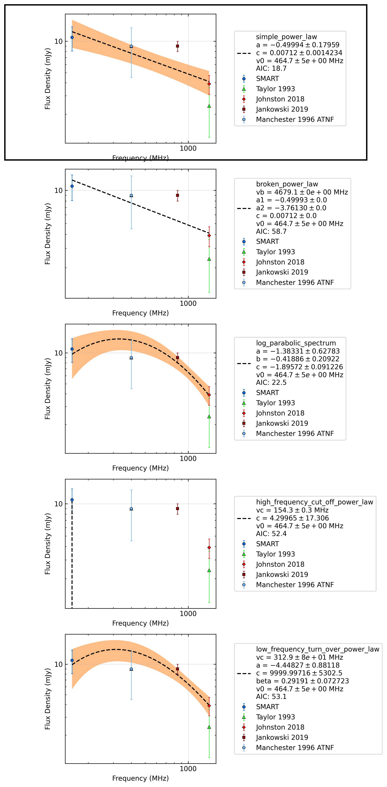

J0134-2937
==========

Best Fit
--------
.. image:: best_fits/J0134-2937_simple_power_law_fit.png
  :width: 800

.. csv-table:: J0134-2937 fit results
   :header: "model","a","b"

   "simple_power_law","-0.51±0.23","0.00±0.00"

Flux Density Results
--------------------
.. csv-table:: J0134-2937 flux density total results
   :header: "N obs", "Flux Density (mJy)", " u_S_mean", "u_scint", "m_r_v"

   "1",  "9.6±6.2", "2.5", "5.7", "0.595"

.. csv-table:: J0134-2937 flux density individual results
   :header: "ObsID", "Flux Density (mJy)"

    "1226062160", "9.6±2.5"

Comparison Fit
--------------

Detection Plots
---------------

