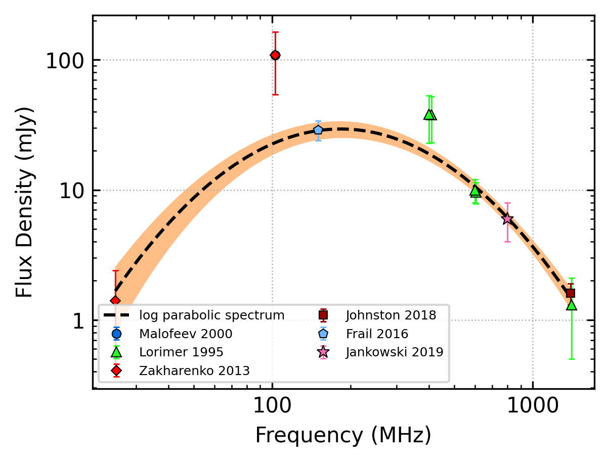
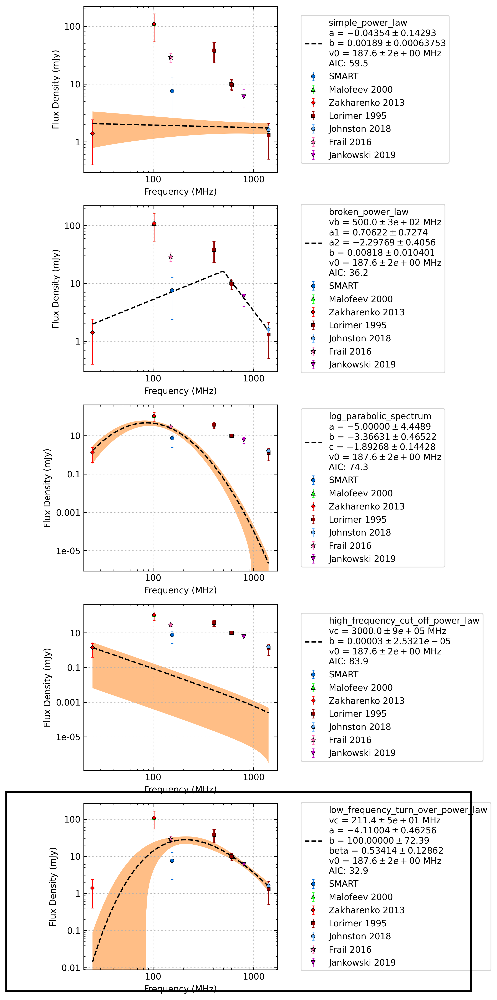
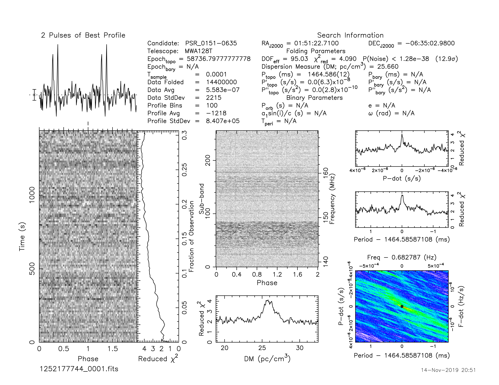
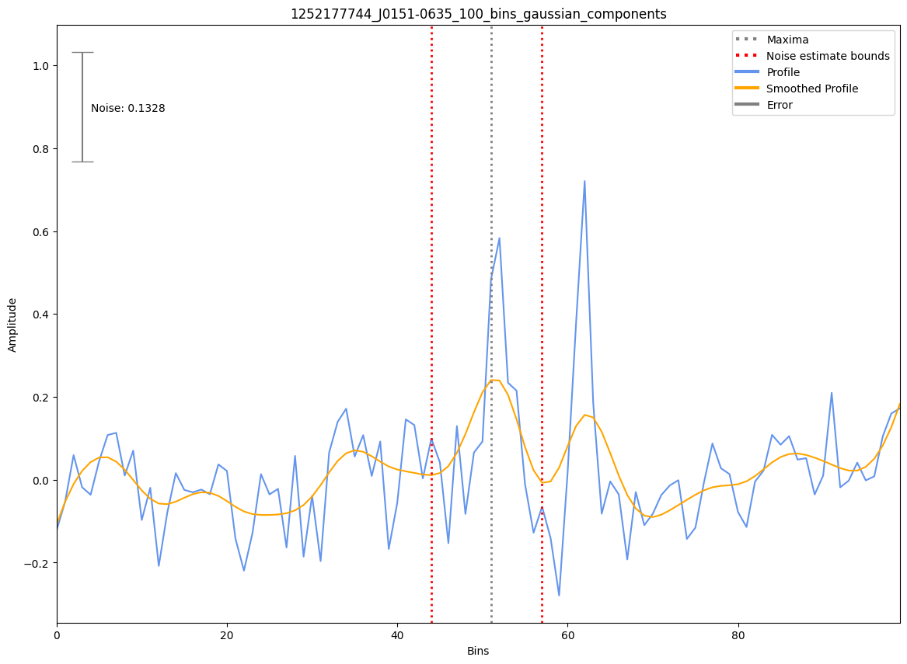

J0151-0635
==========

Best Fit
--------
.. image:: best_fits/J0151-0635_simple_power_law_fit.png
  :width: 800

.. csv-table:: J0151-0635 fit results
   :header: "model","a","b"

   "simple_power_law","-0.51±0.23","0.00±0.00"

Fit Before MWA
--------------

.. csv-table:: J0151-0635 before fit results
   :header: "model","a","b","c"

   "log_parabolic_spectrum","-1.66±0.19","-2.83±0.27","-2.74±0.07"

Flux Density Results
--------------------
.. csv-table:: J0151-0635 flux density total results
   :header: "N obs", "Flux Density (mJy)", " u_S_mean", "u_scint", "m_r_v"

   "0",  "9.6±6.2", "2.5", "5.7", "0.595"

.. csv-table:: J0151-0635 flux density individual results
   :header: "ObsID", "Flux Density (mJy)"

    "1252177744", "nan±nan"

Comparison Fit
--------------

Detection Plots
---------------

