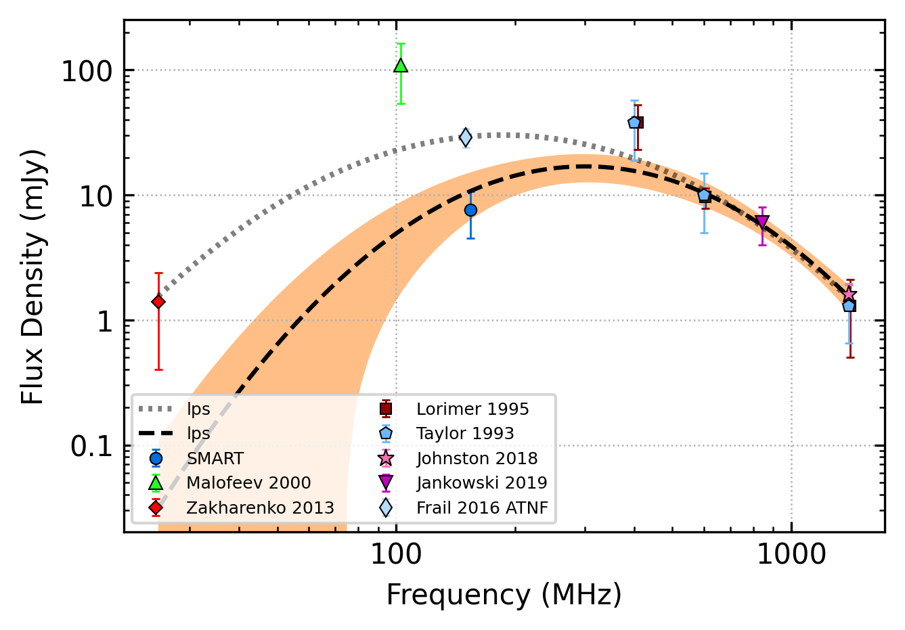

.. _J0151-0635:
J0151-0635
==========

Best Fit
--------

.. csv-table:: J0151-0635 fit results
   :header: "model","vpeak (MHz)","a","c","beta","v0 (MHz)"

   "low_frequency_turn_over_power_law","70±9","-0.89±0.23","0.01±0.00","2.10±2.00","187±1"

Fit Before MWA
--------------

.. csv-table:: J0151-0635 before fit results
   :header: "model","vb (MHz)","a1","a2","c","v0 (MHz)"

   "broken_power_law","965±1156","0.45±0.27","-4.80±9.34","0.00±0.00","187±1"

Flux Density Results
--------------------
.. csv-table:: J0151-0635 flux density total results
   :header: "N obs", "Flux Density (mJy)", "u_S_mean", "u_scint", "m_r_v"

   "1",  "7.6±5.2", "3.1", "4.2", "0.551"

.. csv-table:: J0151-0635 flux density individual results
   :header: "ObsID", "Flux Density (mJy)"

    "1252177744", "7.6±3.1"

Comparison Fit
--------------
.. image:: comparison_fits/J0151-0635_comparison_fit.png
  :width: 800

Detection Plots
---------------

.. image:: on_pulse_plots/1252177744_J0151-0635_100_bins_gaussian_components.png
  :width: 800