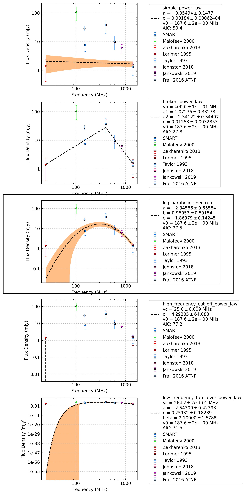

.. _J0151-0635:
J0151-0635
==========

Best Fit
--------
.. image:: best_fits/J0151-0635_o_fit.png
  :width: 800

.. csv-table:: J0151-0635 fit results
   :header: "model","vc (MHz)","a","b","beta","v0 (MHz)"

   "o","211±48","-4.11±0.46","100.00±72.39","0.53±0.13","187±1"

Fit Before MWA
--------------

.. csv-table:: J0151-0635 before fit results
   :header: "model","a","b","c","v0 (MHz)"

   "o","-1.68±0.25","-0.04±0.17","-1.52±0.08","187±1"

Flux Density Results
--------------------
.. csv-table:: J0151-0635 flux density total results
   :header: "N obs", "Flux Density (mJy)", "u_S_mean", "u_scint", "m_r_v"

   "1",  "7.6±5.2", "3.1", "4.2", "0.551"

.. csv-table:: J0151-0635 flux density individual results
   :header: "ObsID", "Flux Density (mJy)"

    "1252177744", "7.6±3.1"

Comparison Fit
--------------

Detection Plots
---------------

.. image:: detection_plots/1252177744_J0151-0635.prepfold.png
  :width: 800

.. image:: on_pulse_plots/1252177744_J0151-0635_100_bins_gaussian_components.png
  :width: 800