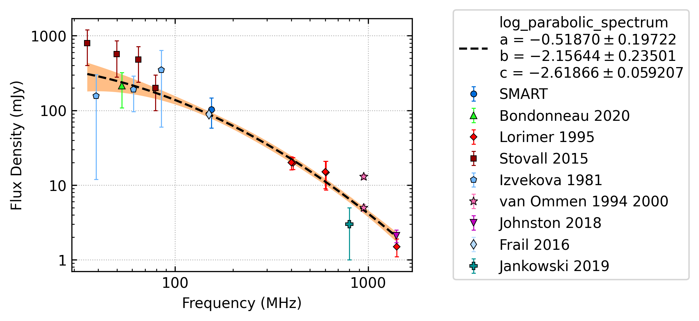
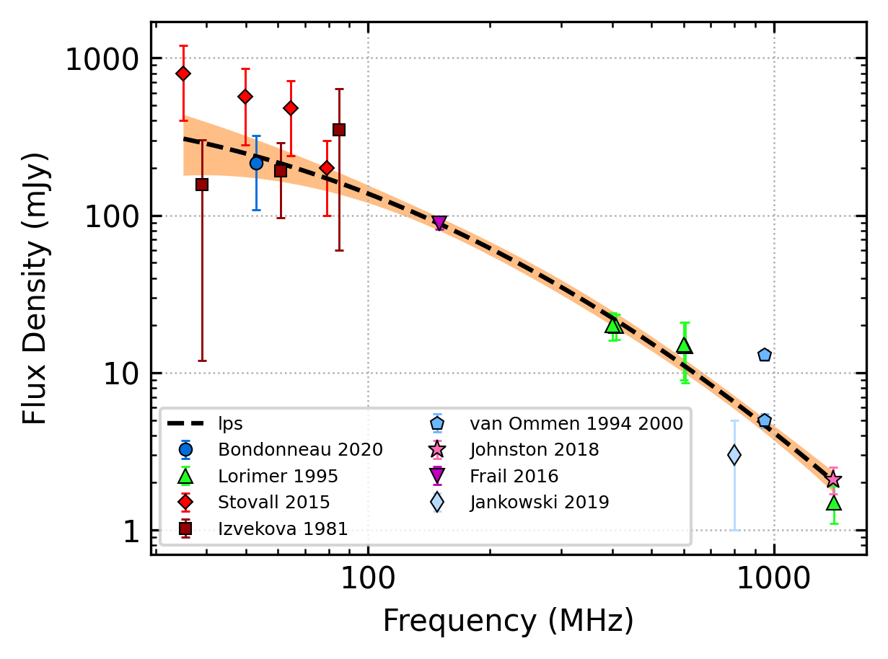
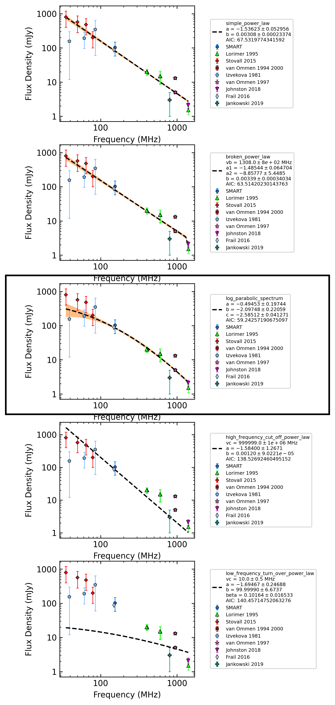
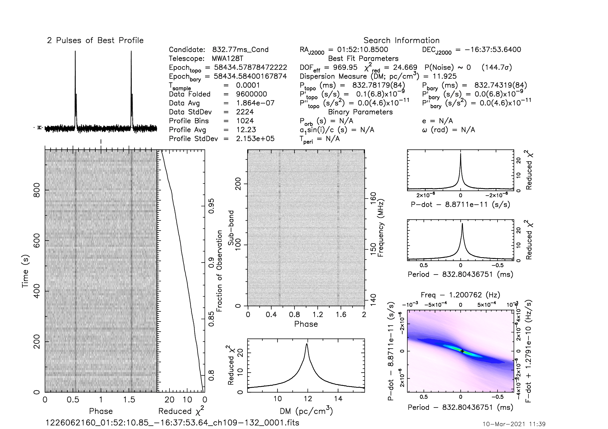
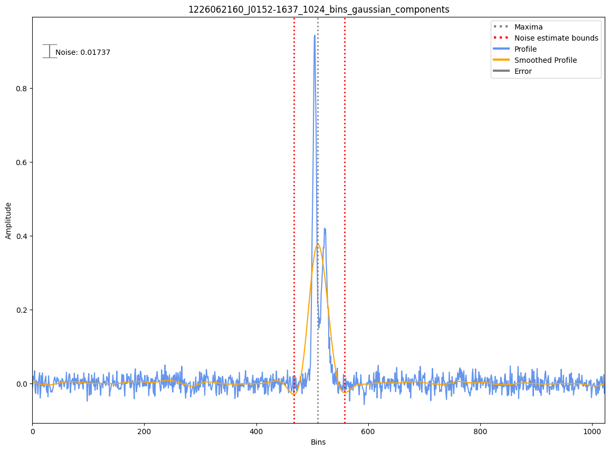
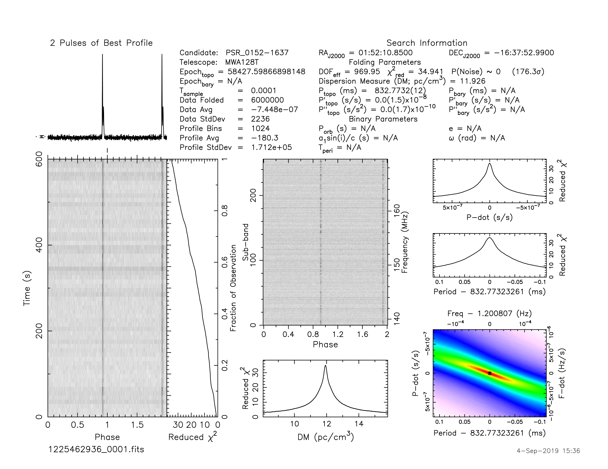
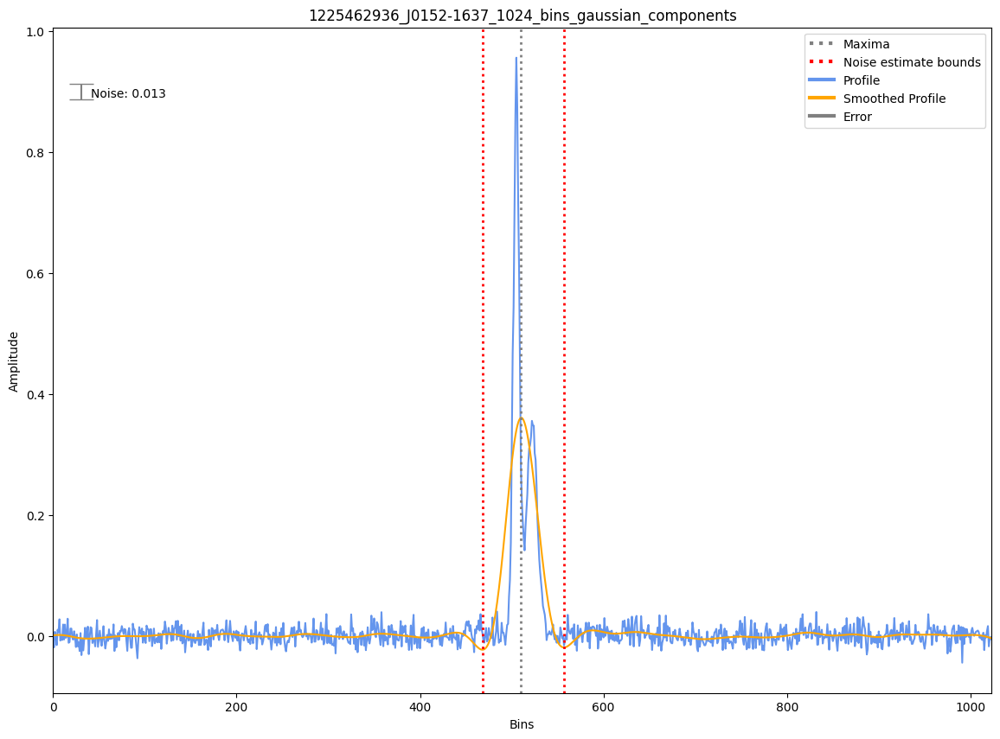
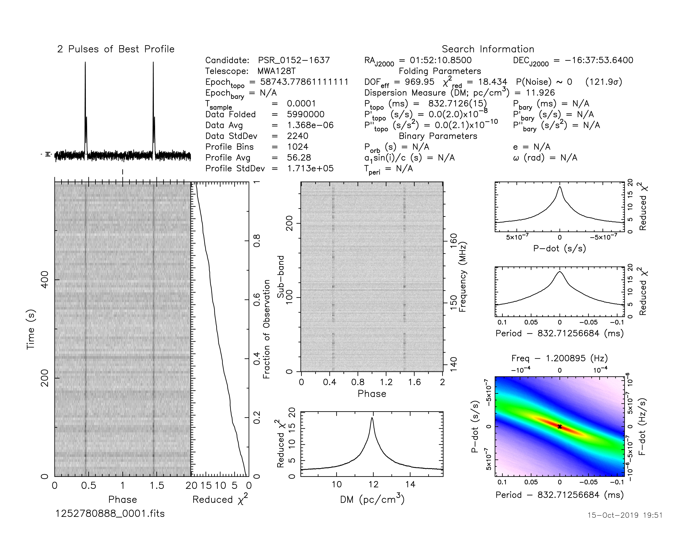
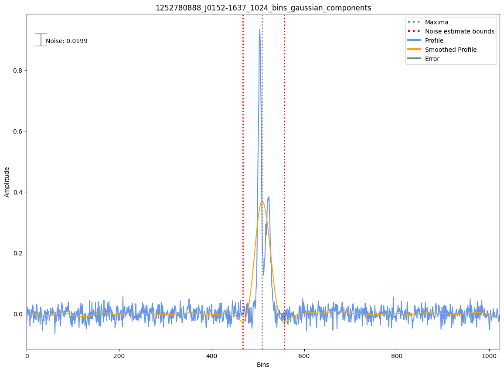

.. _J0152-1637:
J0152-1637
==========

Best Fit
--------

.. csv-table:: J0152-1637 fit results
   :header: "model","a","b","c"

   "log_parabolic_spectrum","-0.49±0.20","-2.10±0.22","-2.59±0.04"

Fit Before MWA
--------------

.. csv-table:: J0152-1637 before fit results
   :header: "model","a","b","c"

   "log_parabolic_spectrum","-0.49±0.20","-2.09±0.22","-2.58±0.04"

Flux Density Results
--------------------
.. csv-table:: J0152-1637 flux density total results
   :header: "N obs", "Flux Density (mJy)", "u_S_mean", "u_scint", "m_r_v"

   "3",  "103.0±44.7", "23.3", "81.4", "0.790"

.. csv-table:: J0152-1637 flux density individual results
   :header: "ObsID", "Flux Density (mJy)"

    "1226062160", "90.8±11.3"
    "1225462936", "130.9±17.0"
    "1252780888", "87.2±11.1"

Comparison Fit
--------------

Detection Plots
---------------

