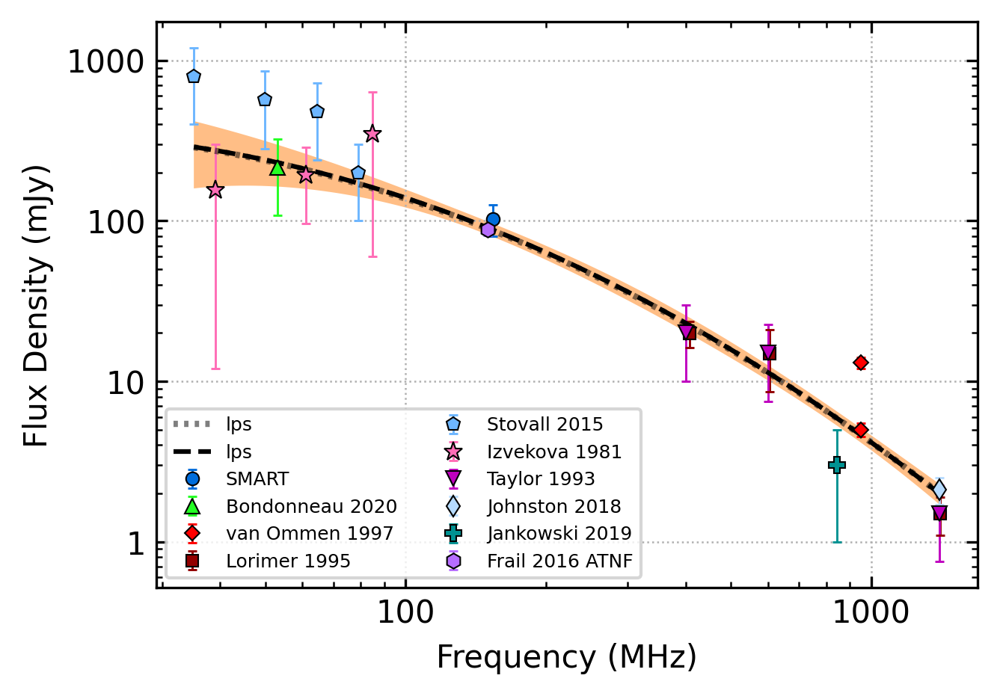

.. _J0152-1637:
J0152-1637
==========

Best Fit
--------

.. csv-table:: J0152-1637 fit results
   :header: "model","vpeak (MHz)","a","c","beta","v0 (MHz)"

   "log_parabolic_spectrum","-0.57±0.21","-1.35±0.12","-1.26±0.05","222±2"

Fit Before MWA
--------------

.. csv-table:: J0152-1637 before fit results
   :header: "model","vpeak (MHz)","a","c","beta","v0 (MHz)"

   "log_parabolic_spectrum","-0.56±0.21","-1.35±0.12","-1.26±0.05","222±2"

Flux Density Results
--------------------
.. csv-table:: J0152-1637 flux density total results
   :header: "N obs", "Flux Density (mJy)", "u_S_mean", "u_scint", "m_r_v"

   "3",  "103.0±44.7", "23.3", "81.4", "0.790"

.. csv-table:: J0152-1637 flux density individual results
   :header: "ObsID", "Flux Density (mJy)"

    "1226062160", "90.8±11.3"
    "1225462936", "130.9±17.0"
    "1252780888", "87.2±11.1"

Comparison Fit
--------------
.. image:: comparison_fits/J0152-1637_comparison_fit.png
  :width: 800

Detection Plots
---------------

.. image:: detection_plots/pf_1226062160_J0152-1637_01:52:10.85_-16:37:53.64_b1024_832.77ms_Cand.pfd.png
  :width: 800

.. image:: on_pulse_plots/1226062160_J0152-1637_1024_bins_gaussian_components.png
  :width: 800
.. image:: detection_plots/1225462936_J0152-1637.prepfold.png
  :width: 800

.. image:: on_pulse_plots/1225462936_J0152-1637_1024_bins_gaussian_components.png
  :width: 800
.. image:: detection_plots/1252780888_J0152-1637.prepfold.png
  :width: 800

.. image:: on_pulse_plots/1252780888_J0152-1637_1024_bins_gaussian_components.png
  :width: 800