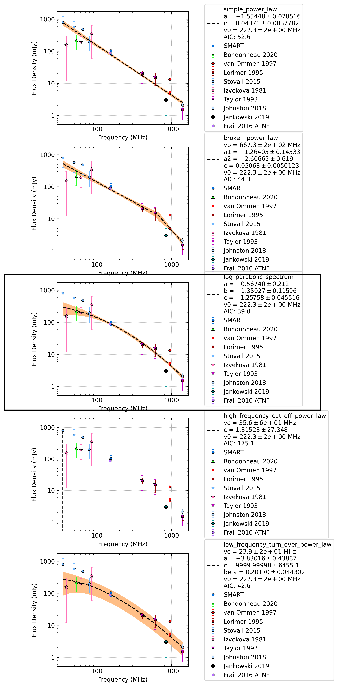

J0152-1637
==========

Best Fit
--------
.. image:: best_fits/J0152-1637_log_parabolic_spectrum_fit.png
  :width: 800

.. csv-table:: J0152-1637 fit results
   :header: "model","a","b","c"

   "log_parabolic_spectrum","-0.49±0.19","-2.12±0.22","-2.61±0.05"

Fit Before MWA
--------------
.. image:: before_mwa/J0152-1637_log_parabolic_spectrum_fit.png
  :width: 800

.. csv-table:: J0152-1637 before fit results
   :header: "model","a","b","c"

   "log_parabolic_spectrum","-0.49±0.19","-2.12±0.22","-2.61±0.05"

Flux Density Results
--------------------
.. csv-table:: J0152-1637 flux density total results
   :header: "N obs", "Flux Density (mJy)", "u_S_mean", "u_scint", "m_r_v"

   "2",  "97.1±53.0", "17.9", "76.7", "0.790"

.. csv-table:: J0152-1637 flux density individual results
   :header: "ObsID", "Flux Density (mJy)"

    "1226062160", "79.5±9.9"
    "1225462936", "114.6±14.9"
    "1252780888", "nan±nan"

Comparison Fit
--------------

Detection Plots
---------------

.. image:: detection_plots/pf_1226062160_J0152-1637_01:52:10.85_-16:37:53.64_b1024_832.77ms_Cand.pfd.png
  :width: 800

.. image:: on_pulse_plots/1226062160_J0152-1637_1024_bins_gaussian_components.png
  :width: 800

.. image:: detection_plots/1252780888_J0152-1637.prepfold.png
  :width: 800

