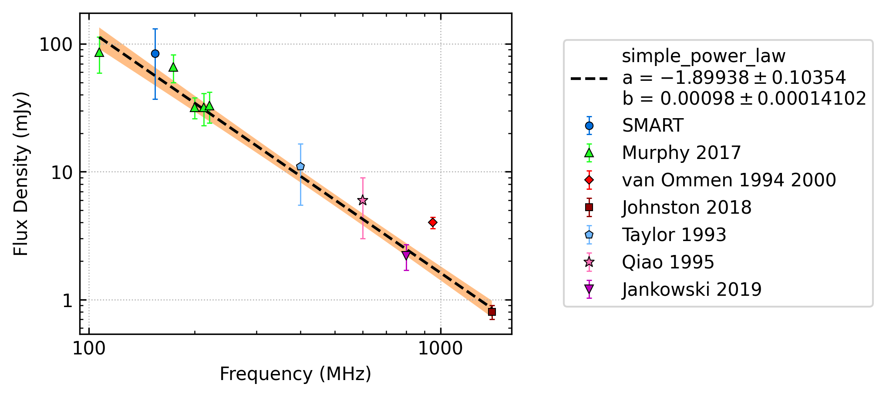
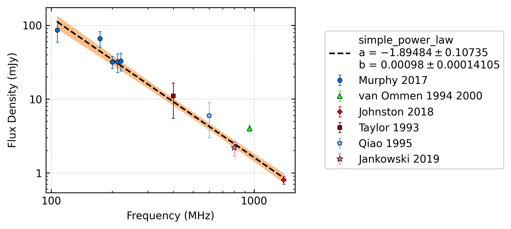
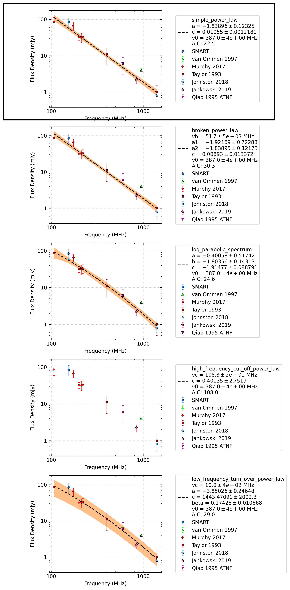
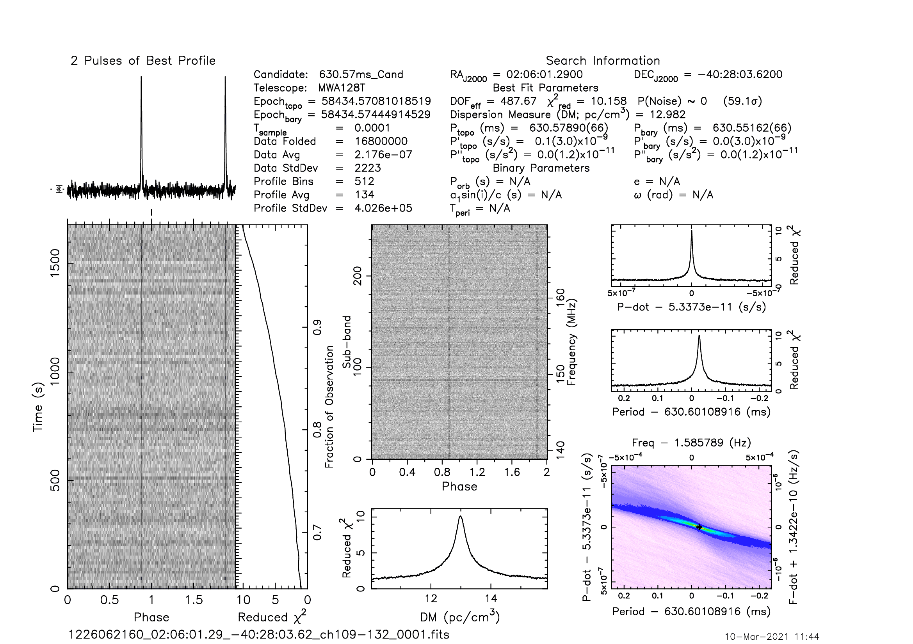
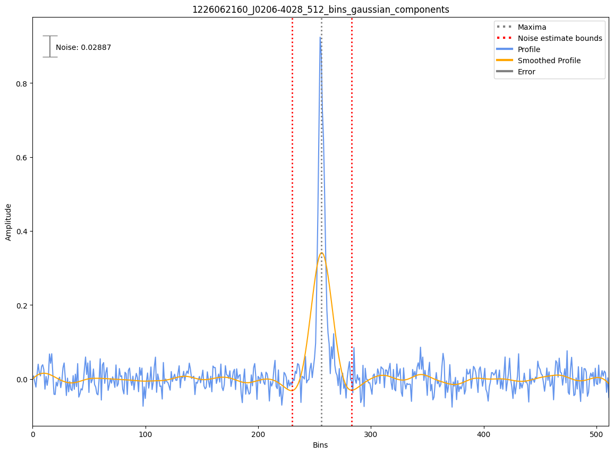
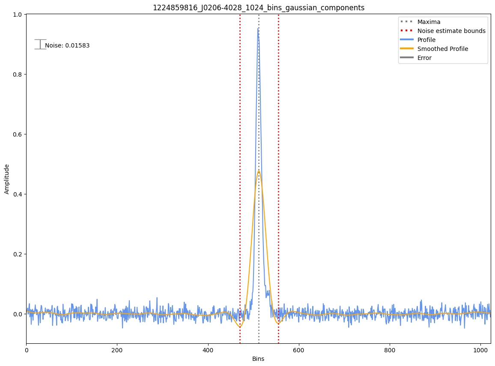
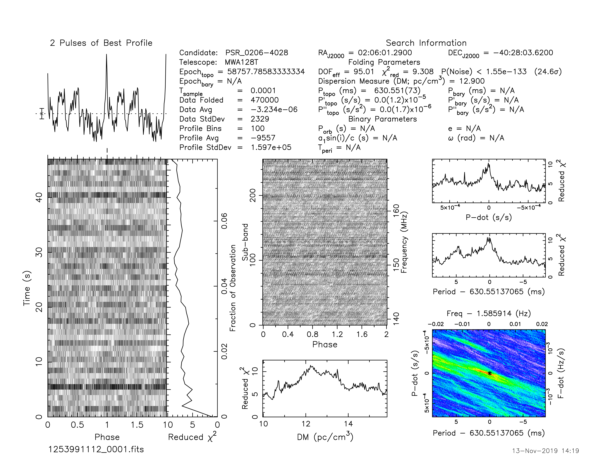
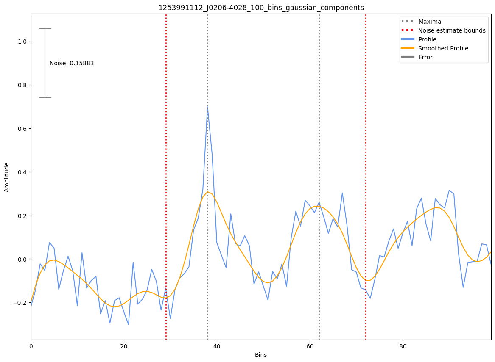

.. _J0206-4028:
J0206-4028
==========

Best Fit
--------

.. csv-table:: J0206-4028 fit results
   :header: "model","a","b"

   "simple_power_law","-1.87±0.10","0.00±0.00"

Fit Before MWA
--------------

.. csv-table:: J0206-4028 before fit results
   :header: "model","a","b"

   "simple_power_law","-1.87±0.10","0.00±0.00"

Flux Density Results
--------------------
.. csv-table:: J0206-4028 flux density total results
   :header: "N obs", "Flux Density (mJy)", "u_S_mean", "u_scint", "m_r_v"

   "2",  "68.1±45.4", "14.2", "51.9", "0.762"

.. csv-table:: J0206-4028 flux density individual results
   :header: "ObsID", "Flux Density (mJy)"

    "1226062160", "24.9±4.6"
    "1224859816", "111.2±13.5"
    "1253991112", "nan±nan"

Comparison Fit
--------------

Detection Plots
---------------

.. image:: detection_plots/1224859816_J0206-4028.prepfold.png
  :width: 800

