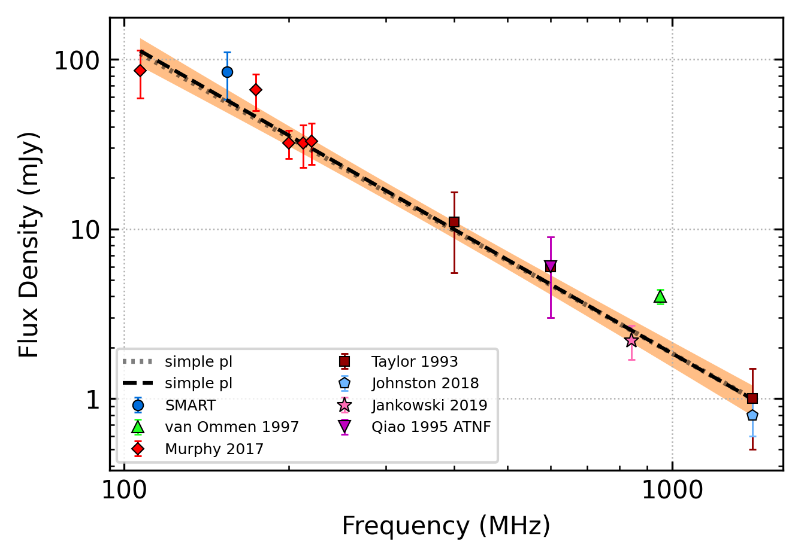

.. _J0206-4028:
J0206-4028
==========

Best Fit
--------

.. csv-table:: J0206-4028 fit results
   :header: "model","a","b","v0 (MHz)"

   "simple_power_law","-1.83±0.13","0.01±0.00","387±3"

Fit Before MWA
--------------

.. csv-table:: J0206-4028 before fit results
   :header: "model","a","b","v0 (MHz)"

   "simple_power_law","-1.82±0.13","0.01±0.00","387±3"

Flux Density Results
--------------------
.. csv-table:: J0206-4028 flux density total results
   :header: "N obs", "Flux Density (mJy)", "u_S_mean", "u_scint", "m_r_v"

   "3",  "84.2±47.2", "26.3", "64.1", "0.762"

.. csv-table:: J0206-4028 flux density individual results
   :header: "ObsID", "Flux Density (mJy)"

    "1226062160", "28.4±5.2"
    "1224859816", "128.9±15.6"
    "1253991112", "95.3±20.6"

Comparison Fit
--------------
.. image:: comparison_fits/J0206-4028_comparison_fit.png
  :width: 800

Detection Plots
---------------

.. image:: detection_plots/pf_1226062160_J0206-4028_02:06:01.29_-40:28:03.62_b512_630.57ms_Cand.pfd.png
  :width: 800

.. image:: on_pulse_plots/1226062160_J0206-4028_512_bins_gaussian_components.png
  :width: 800
.. image:: detection_plots/pf_1224859816_J0206-4028_02:06:01.29_-40:28:03.62_b1024_630.56ms_Cand.pfd.png
  :width: 800

.. image:: on_pulse_plots/1224859816_J0206-4028_1024_bins_gaussian_components.png
  :width: 800
.. image:: detection_plots/pf_1253991112_J0206-4028_02:06:01.29_-40:28:03.62_b1024_630.38ms_Cand.pfd.png
  :width: 800

