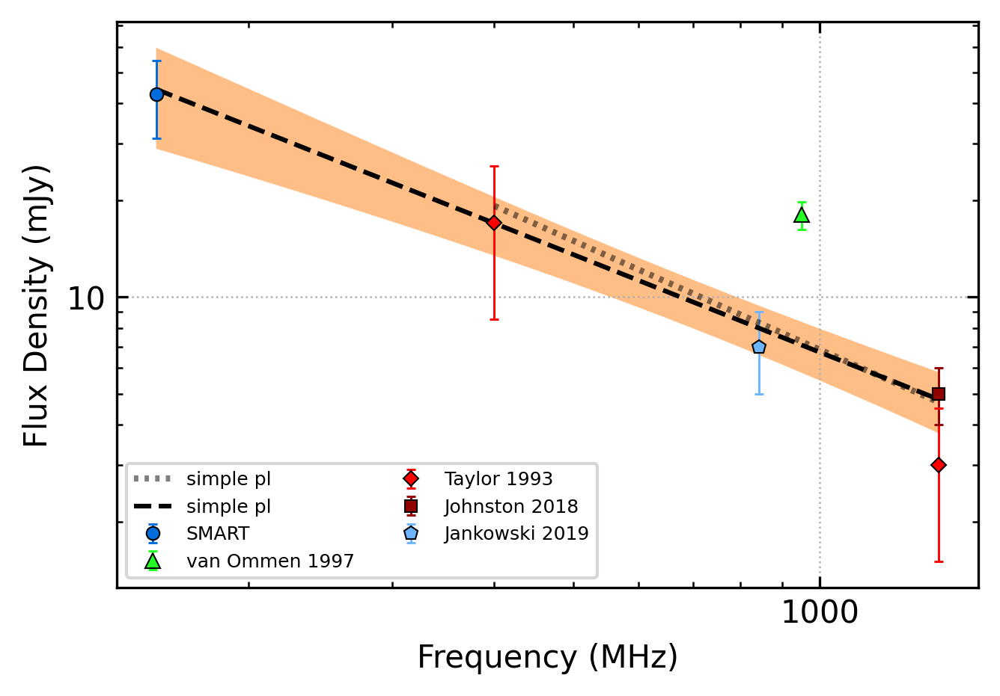
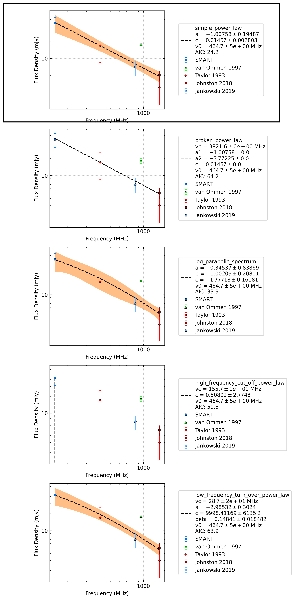
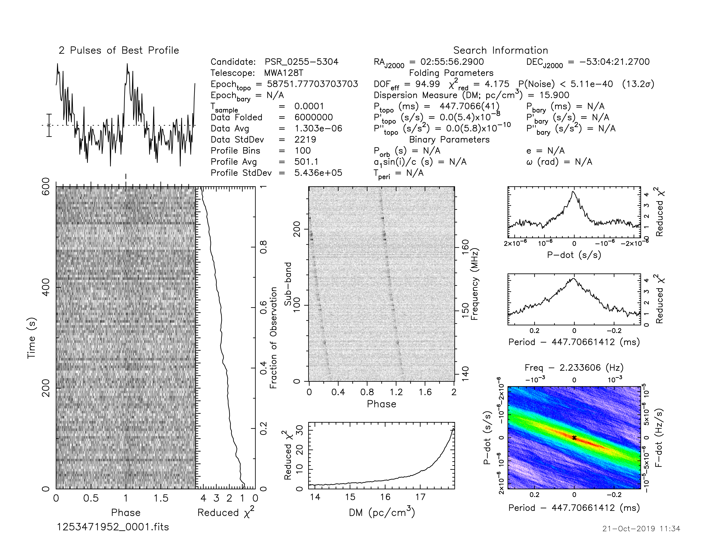

.. _J0255-5304:
J0255-5304
==========

Best Fit
--------

.. csv-table:: J0255-5304 fit results
   :header: "model","a","b","v0 (MHz)"

   "simple_power_law","-0.93±0.36","0.01±0.00","464±4"

Fit Before MWA
--------------

.. csv-table:: J0255-5304 before fit results
   :header: "model","a","b","v0 (MHz)"

   "simple_power_law","-0.91±0.50","0.01±0.00","748±7"

Flux Density Results
--------------------
.. csv-table:: J0255-5304 flux density total results
   :header: "N obs", "Flux Density (mJy)", "u_S_mean", "u_scint", "m_r_v"

   "2",  "42.8±27.1", "11.7", "29.5", "0.690"

.. csv-table:: J0255-5304 flux density individual results
   :header: "ObsID", "Flux Density (mJy)"

    "1224859816", "18.4±5.6"
    "1253471952", "67.2±10.3"

Comparison Fit
--------------

Detection Plots
---------------

.. image:: detection_plots/1224859816_J0255-5304.prepfold.png
  :width: 800

.. image:: on_pulse_plots/1224859816_J0255-5304_128_bins_gaussian_components.png
  :width: 800

.. image:: on_pulse_plots/1253471952_J0255-5304_100_bins_gaussian_components.png
  :width: 800