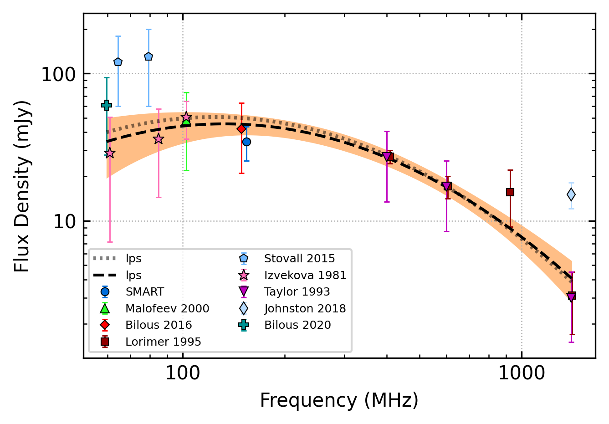

.. _J0304+1932:
J0304+1932
==========

Best Fit
--------

.. csv-table:: J0304+1932 fit results
   :header: "model","vpeak (MHz)","a","c","beta","v0 (MHz)"

   "low_frequency_turn_over_power_law","169±17","-7.57±0.16","353763191174379601920000.00±353763191174379601920000.00","0.13±0.00","186±1"

Fit Before MWA
--------------

.. csv-table:: J0304+1932 before fit results
   :header: "model","vpeak (MHz)","a","c","beta","v0 (MHz)"

   "low_frequency_turn_over_power_law","169±32","-7.58±0.03","436665627437357636517888.00±414530152300189061218304.00","0.13±0.00","186±1"

Flux Density Results
--------------------
.. csv-table:: J0304+1932 flux density total results
   :header: "N obs", "Flux Density (mJy)", "u_S_mean", "u_scint", "m_r_v"

   "1",  "34.5±25.6", "9.0", "24.0", "0.695"

.. csv-table:: J0304+1932 flux density individual results
   :header: "ObsID", "Flux Density (mJy)"

    "1254594264", "34.5±9.0"

Comparison Fit
--------------
.. image:: comparison_fits/J0304+1932_comparison_fit.png
  :width: 800

Detection Plots
---------------

.. image:: detection_plots/1254594264_J0304+1932.prepfold.png
  :width: 800

.. image:: on_pulse_plots/1254594264_J0304+1932_100_bins_gaussian_components.png
  :width: 800