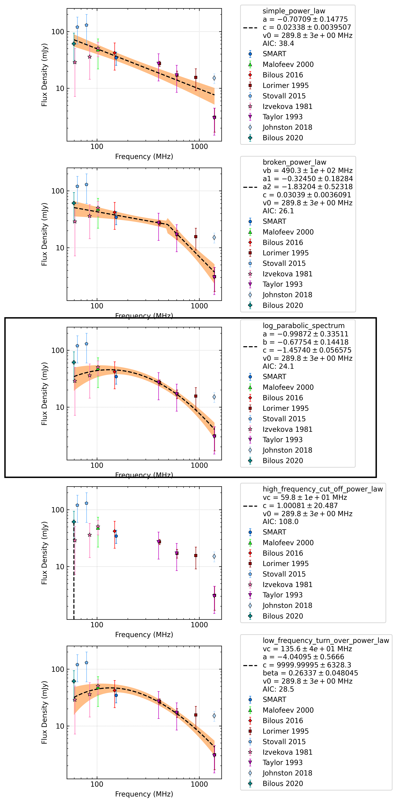

.. _J0304+1932:
J0304+1932
==========

Best Fit
--------
.. image:: best_fits/J0304+1932_log_parabolic_spectrum_fit.png
  :width: 800

.. csv-table:: J0304+1932 fit results
   :header: "model","a","b","c"

   "log_parabolic_spectrum","-0.92±0.32","-1.86±0.45","-2.28±0.14"

Fit Before MWA
--------------
.. image:: before_mwa/J0304+1932_log_parabolic_spectrum_fit.png
  :width: 800

.. csv-table:: J0304+1932 before fit results
   :header: "model","a","b","c"

   "log_parabolic_spectrum","-0.93±0.31","-1.89±0.45","-2.29±0.14"

Flux Density Results
--------------------
.. csv-table:: J0304+1932 flux density total results
   :header: "N obs", "Flux Density (mJy)", "u_S_mean", "u_scint", "m_r_v"

   "1",  "29.6±22.0", "7.7", "20.6", "0.695"

.. csv-table:: J0304+1932 flux density individual results
   :header: "ObsID", "Flux Density (mJy)"

    "1254594264", "29.6±7.7"

Comparison Fit
--------------

Detection Plots
---------------

.. image:: on_pulse_plots/1254594264_J0304+1932_100_bins_gaussian_components.png
  :width: 800