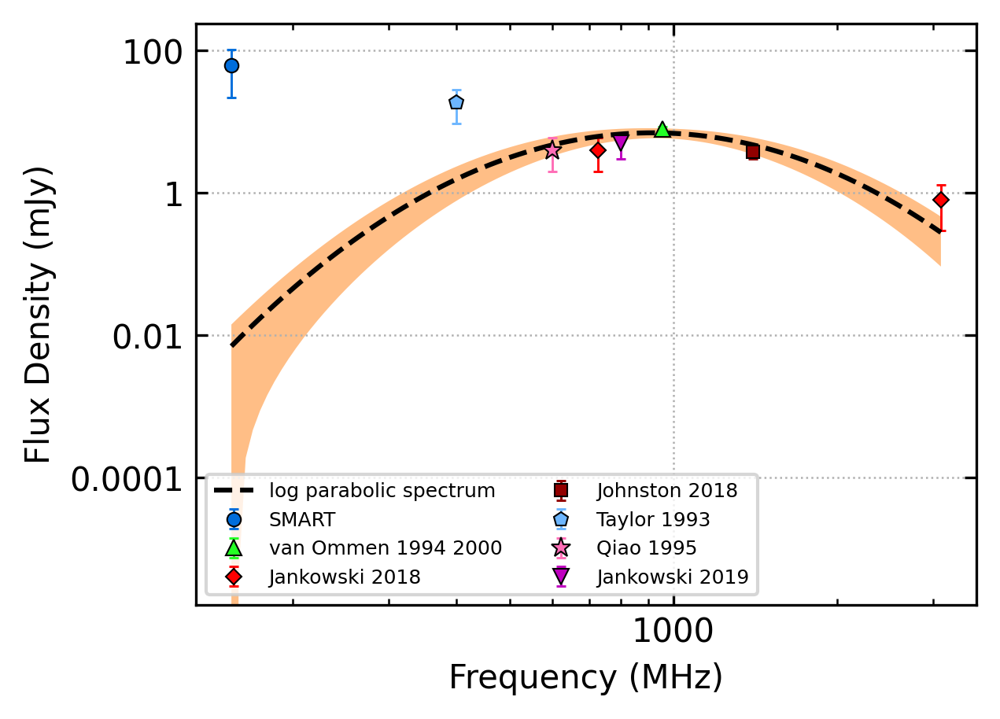
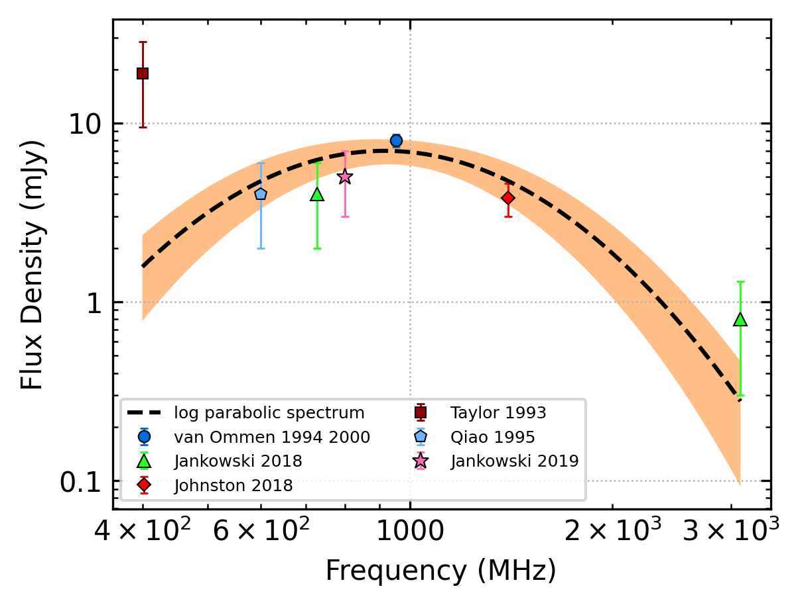

.. _J0401-7608:
J0401-7608
==========

Best Fit
--------

.. csv-table:: J0401-7608 fit results
   :header: "model","a","b","c"

   "log_parabolic_spectrum","-5.00±4.70","-1.52±0.55","-2.27±0.10"

Fit Before MWA
--------------

.. csv-table:: J0401-7608 before fit results
   :header: "model","a","b","c"

   "log_parabolic_spectrum","-5.00±4.70","-1.52±0.55","-2.27±0.10"

Flux Density Results
--------------------
.. csv-table:: J0401-7608 flux density total results
   :header: "N obs", "Flux Density (mJy)", "u_S_mean", "u_scint", "m_r_v"

   "1",  "62.5±40.4", "15.5", "37.3", "0.596"

.. csv-table:: J0401-7608 flux density individual results
   :header: "ObsID", "Flux Density (mJy)"

    "1255803168", "62.5±15.5"

Comparison Fit
--------------
.. image:: comparison_fits/J0401-7608_comparison_fit.png
  :width: 800

Detection Plots
---------------

.. image:: detection_plots/1255803168_J0401-7608.prepfold.png
  :width: 800

.. image:: on_pulse_plots/1255803168_J0401-7608_100_bins_gaussian_components.png
  :width: 800