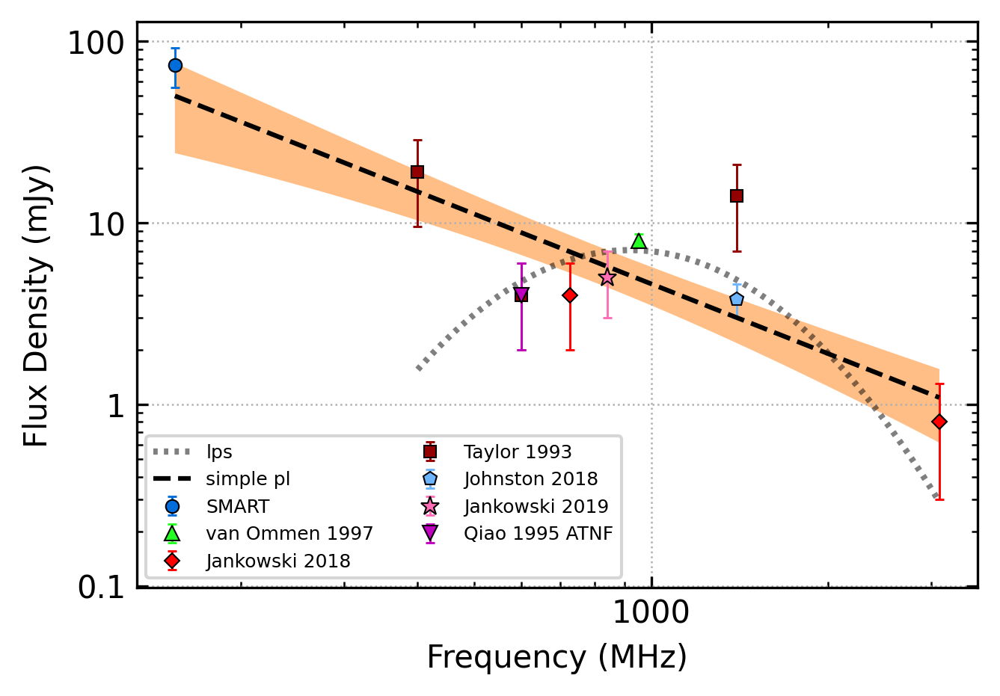

.. _J0401-7608:
J0401-7608
==========

Best Fit
--------

.. csv-table:: J0401-7608 fit results
   :header: "model","a","c","v0 (MHz)"

   "simple_power_law","-1.25±0.32","0.01±0.00","691±6"

Fit Before MWA
--------------

.. csv-table:: J0401-7608 before fit results
   :header: "model","a","c","v0 (MHz)"

   "simple_power_law","-1.19±0.35","0.00±0.00","1113±11"

Flux Density Results
--------------------
.. csv-table:: J0401-7608 flux density total results
   :header: "N obs", "Flux Density (mJy)", "u_S_mean", "u_scint", "m_r_v"

   "1",  "73.8±47.7", "18.3", "44.0", "0.596"

.. csv-table:: J0401-7608 flux density individual results
   :header: "ObsID", "Flux Density (mJy)"

    "1255803168", "73.8±18.3"

Comparison Fit
--------------
.. image:: comparison_fits/J0401-7608_comparison_fit.png
  :width: 800

Detection Plots
---------------

.. image:: detection_plots/1255803168_J0401-7608.prepfold.png
  :width: 800

.. image:: on_pulse_plots/1255803168_J0401-7608_100_bins_gaussian_components.png
  :width: 800