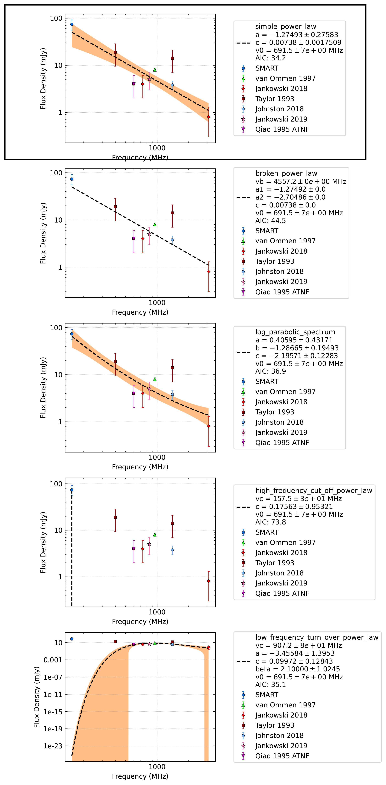

.. _J0401-7608:
J0401-7608
==========

Best Fit
--------
.. image:: best_fits/J0401-7608_broken_power_law_fit.png
  :width: 800

.. csv-table:: J0401-7608 fit results
   :header: "model","vb (MHz)","a1","a2","b"

   "broken_power_law","956±107","1.92±1.09","-1.96±0.82","0.01±0.01"

Fit Before MWA
--------------
.. image:: before_mwa/J0401-7608_log_parabolic_spectrum_fit.png
  :width: 800

.. csv-table:: J0401-7608 before fit results
   :header: "model","a","b","c"

   "log_parabolic_spectrum","-5.00±1.57","-1.50±0.60","-2.23±0.09"

Flux Density Results
--------------------
.. csv-table:: J0401-7608 flux density total results
   :header: "N obs", "Flux Density (mJy)", "u_S_mean", "u_scint", "m_r_v"

   "1",  "62.5±40.4", "15.5", "37.3", "0.596"

.. csv-table:: J0401-7608 flux density individual results
   :header: "ObsID", "Flux Density (mJy)"

    "1255803168", "62.5±15.5"

Comparison Fit
--------------

Detection Plots
---------------

