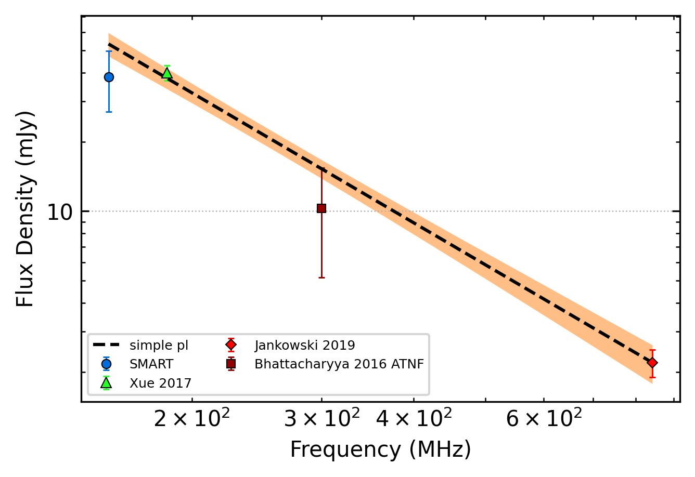
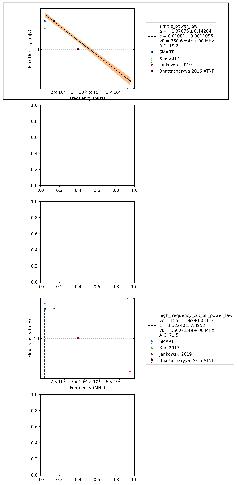

.. _J0418-4154:
J0418-4154
==========

Best Fit
--------

.. csv-table:: J0418-4154 fit results
   :header: "model","a","c","v0 (MHz)"

   "simple_power_law","-1.88±0.14","0.01±0.00","360±3"

Flux Density Results
--------------------
.. csv-table:: J0418-4154 flux density total results
   :header: "N obs", "Flux Density (mJy)", "u_S_mean", "u_scint", "m_r_v"

   "1",  "38.4±24.5", "11.3", "21.7", "0.565"

.. csv-table:: J0418-4154 flux density individual results
   :header: "ObsID", "Flux Density (mJy)"

    "1253991112", "38.4±11.3"

Comparison Fit
--------------

Detection Plots
---------------

.. image:: detection_plots/1253991112_J0418-4154.prepfold.png
  :width: 800

