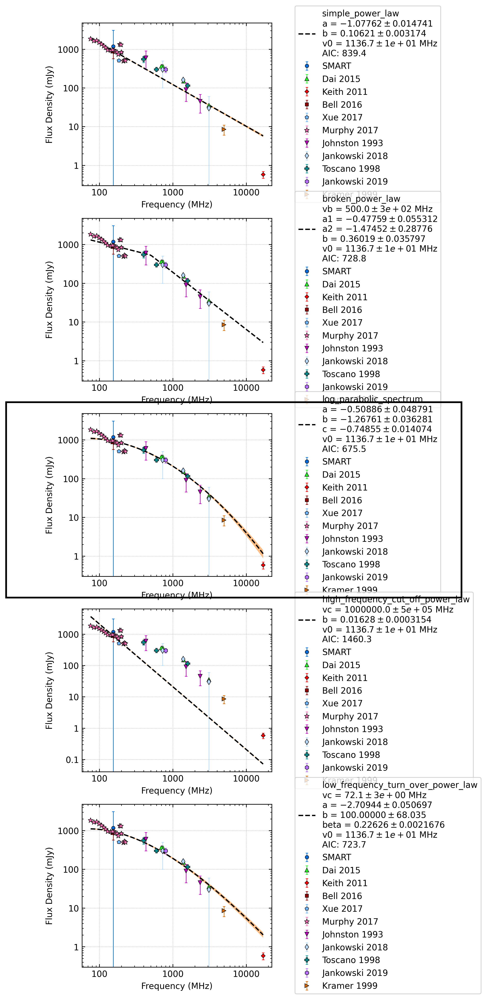

.. _J0437-4715:
J0437-4715
==========

Best Fit
--------
.. image:: best_fits/J0437-4715_o_fit.png
  :width: 800

.. csv-table:: J0437-4715 fit results
   :header: "model","a","b","c","v0 (MHz)"

   "o","-0.51±0.05","-1.27±0.04","-0.75±0.01","1136±11"

Fit Before MWA
--------------

.. csv-table:: J0437-4715 before fit results
   :header: "model","a","b","c","v0 (MHz)"

   "o","-0.51±0.05","-1.27±0.04","-0.75±0.01","1136±11"

Flux Density Results
--------------------
.. csv-table:: J0437-4715 flux density total results
   :header: "N obs", "Flux Density (mJy)", "u_S_mean", "u_scint", "m_r_v"

   "1",  "1179.0±1906.0", "237.7", "1891.1", "1.604"

.. csv-table:: J0437-4715 flux density individual results
   :header: "ObsID", "Flux Density (mJy)"

    "1257617424", "1179.0±237.7"

Comparison Fit
--------------

Detection Plots
---------------

.. image:: detection_plots/pf_1257617424_J0437-4715_04:37:15.89_-47:15:09.11_b50_PSR_J0437-4715.pfd.png
  :width: 800

.. image:: on_pulse_plots/
  :width: 800