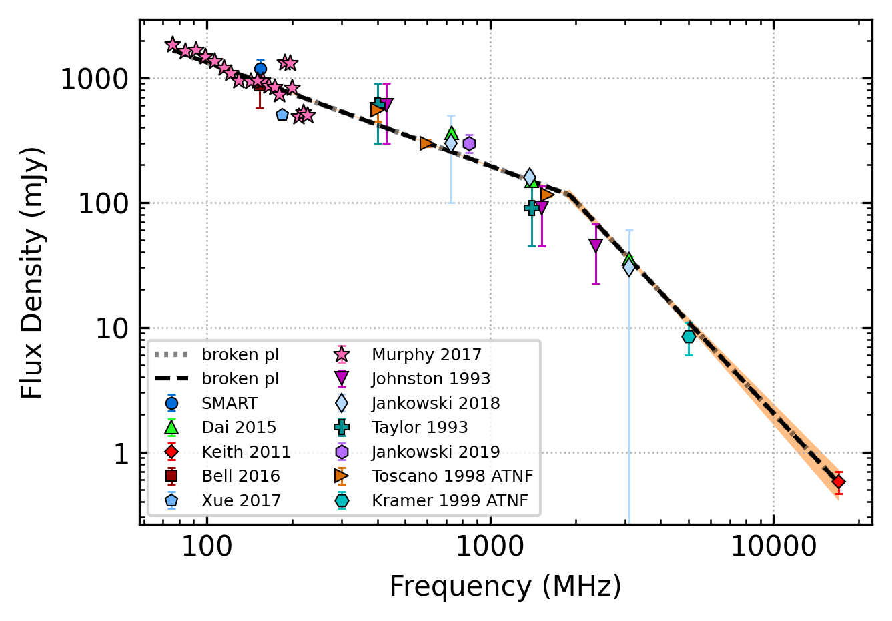

.. _J0437-4715:
J0437-4715
==========

Best Fit
--------

.. csv-table:: J0437-4715 fit results
   :header: "model","vb (MHz)","a1","a2","c","v0 (MHz)"

   "broken_power_law","2346±35","-0.93±0.01","-2.49±0.14","0.14±0.00","1136±11"

Fit Before MWA
--------------

.. csv-table:: J0437-4715 before fit results
   :header: "model","vb (MHz)","a1","a2","c","v0 (MHz)"

   "broken_power_law","2346±35","-0.93±0.01","-2.49±0.14","0.14±0.00","1136±11"

Flux Density Results
--------------------
.. csv-table:: J0437-4715 flux density total results
   :header: "N obs", "Flux Density (mJy)", "u_S_mean", "u_scint", "m_r_v"

   "1",  "1179.0±1906.0", "237.7", "1891.1", "1.604"

.. csv-table:: J0437-4715 flux density individual results
   :header: "ObsID", "Flux Density (mJy)"

    "1257617424", "1179.0±237.7"

Comparison Fit
--------------
.. image:: comparison_fits/J0437-4715_comparison_fit.png
  :width: 800

Detection Plots
---------------

.. image:: on_pulse_plots/
  :width: 800