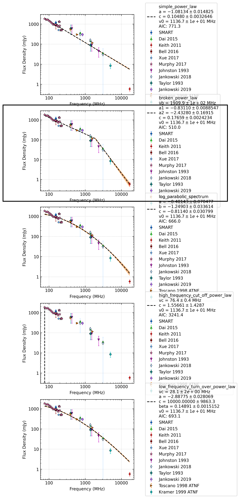

J0437-4715
==========

Best Fit
--------
.. image:: best_fits/J0437-4715_log_parabolic_spectrum_fit.png
  :width: 800

.. csv-table:: J0437-4715 fit results
   :header: "model","a","b","c"

   "log_parabolic_spectrum","-5.00±4.70","-1.52±0.55","-2.27±0.10"

Fit Before MWA
--------------
.. image:: before_mwa/J0437-4715_broken_power_law_fit.png
  :width: 800

.. csv-table:: J0437-4715 before fit results
   :header: "model","vb (MHz)","a1","a2","b"

   "broken_power_law","1914±91","-0.83±0.01","-2.44±0.13","0.16±0.00"

Flux Density Results
--------------------
.. csv-table:: J0437-4715 flux density total results
   :header: "N obs", "Flux Density (mJy)", " u_S_mean", "u_scint", "m_r_v"

   "0",  "62.5±40.4", "15.5", "37.3", "0.596"

.. csv-table:: J0437-4715 flux density individual results
   :header: "ObsID", "Flux Density (mJy)"

    "1257617424", "nan±nan"

Comparison Fit
--------------

Detection Plots
---------------
