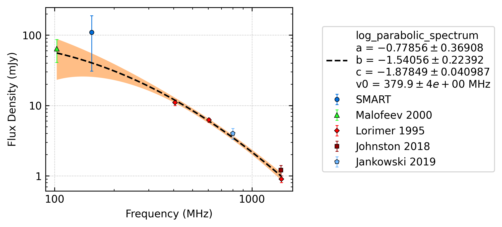
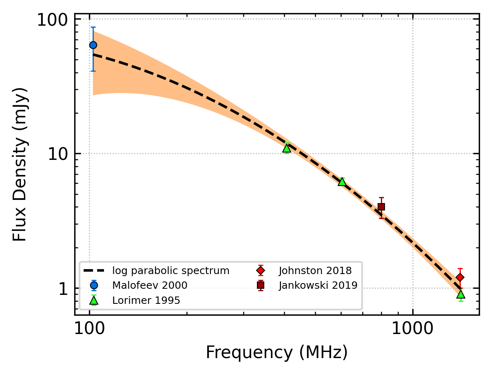
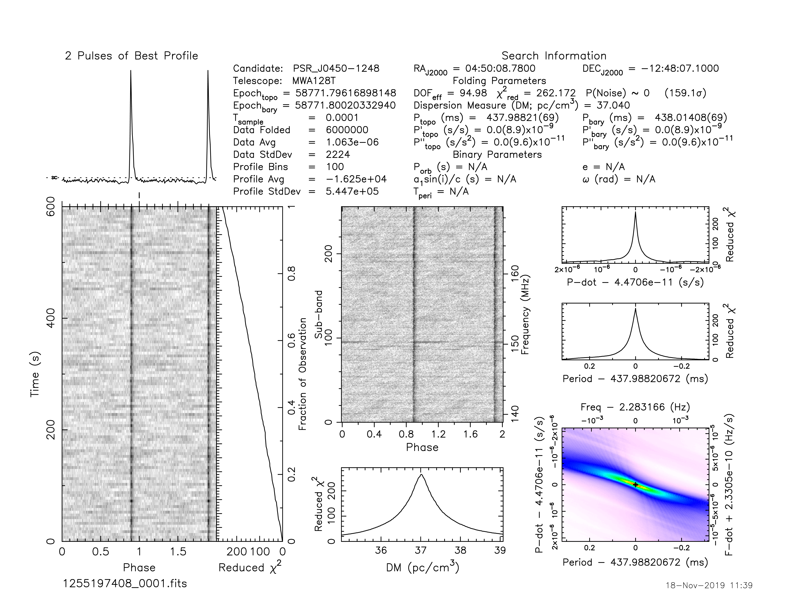
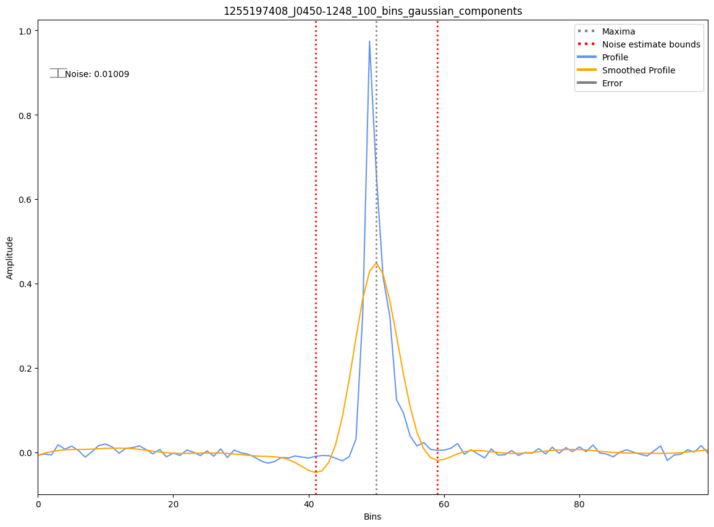
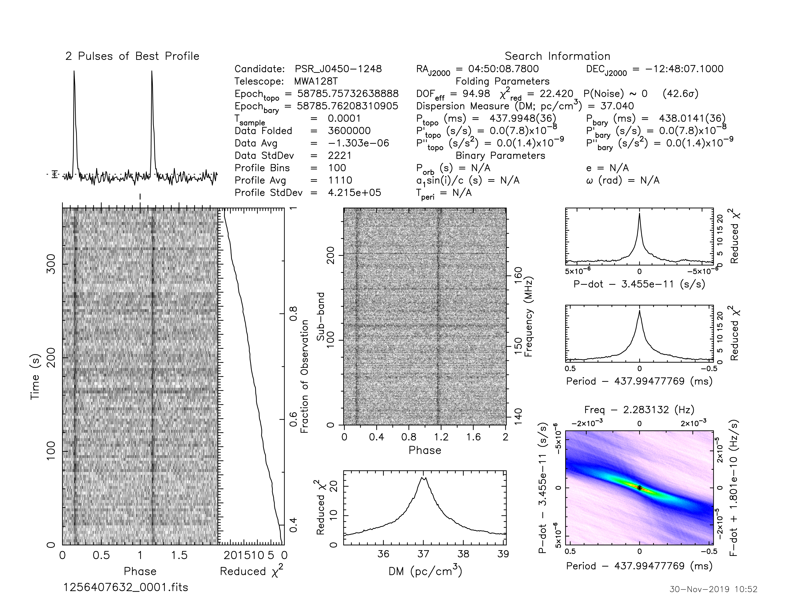
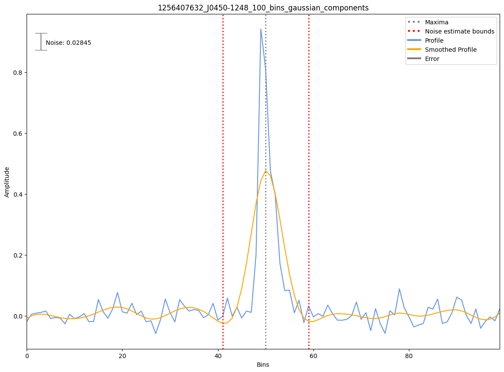
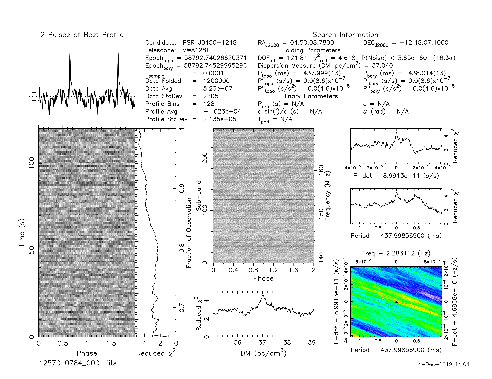
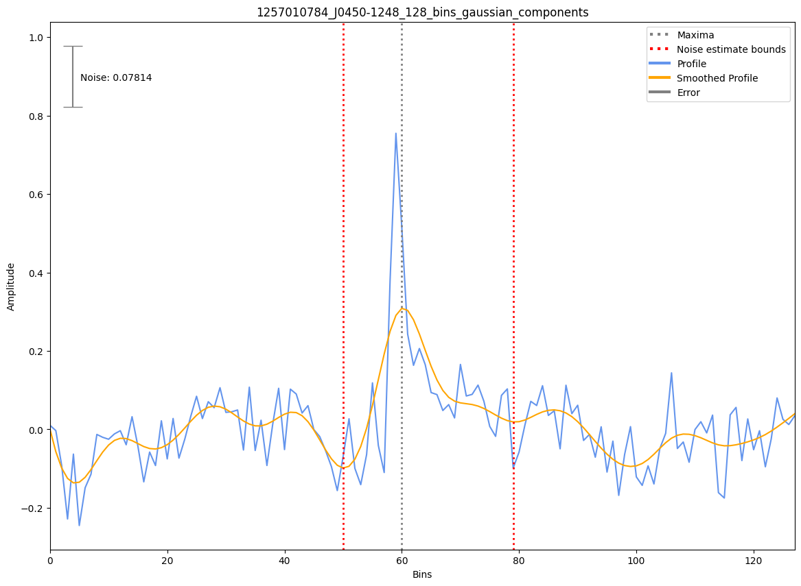
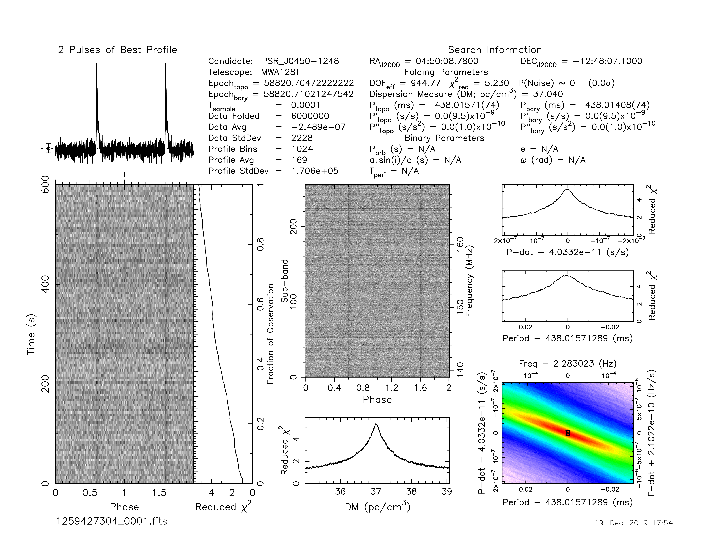

J0450-1248
==========

Best Fit
--------

.. csv-table:: J0450-1248 fit results
   :header: "model","a","b","c"

   "log_parabolic_spectrum","-0.77±0.29","-2.38±0.23","-2.92±0.05"

Fit Before MWA
--------------

.. csv-table:: J0450-1248 before fit results
   :header: "model","a","b","c"

   "log_parabolic_spectrum","-0.80±0.32","-2.39±0.24","-2.92±0.05"

Flux Density Results
--------------------
.. csv-table:: J0450-1248 flux density total results
   :header: "N obs", "Flux Density (mJy)", " u_S_mean", "u_scint", "m_r_v"

   "4",  "93.7±67.2", "56.4", "43.4", "0.464"

.. csv-table:: J0450-1248 flux density individual results
   :header: "ObsID", "Flux Density (mJy)"

    "1255197408", "167.4±47.3"
    "1256407632", "111.5±28.4"
    "1257010784", "40.1±10.1"
    "1259427304", "55.6±5.6"

Comparison Fit
--------------
.. image:: comparison_fits/J0450-1248_comparison_fit.png
  :width: 800

Detection Plots
---------------

.. image:: on_pulse_plots/1259427304_J0450-1248_1024_bins_gaussian_components.png
  :width: 800