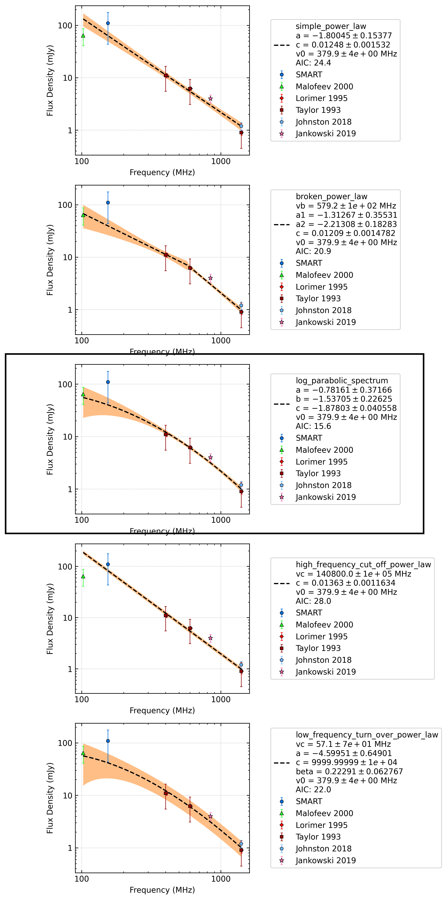

.. _J0450-1248:
J0450-1248
==========

Best Fit
--------

.. csv-table:: J0450-1248 fit results
   :header: "model","vc (MHz)","a","c","v0 (MHz)"

   "log_parabolic_spectrum","-0.78±0.37","-1.54±0.23","-1.88±0.04","379±3"

Fit Before MWA
--------------

.. csv-table:: J0450-1248 before fit results
   :header: "model","vc (MHz)","a","c","v0 (MHz)"

   "log_parabolic_spectrum","-0.82±0.40","-1.51±0.25","-1.88±0.04","379±3"

Flux Density Results
--------------------
.. csv-table:: J0450-1248 flux density total results
   :header: "N obs", "Flux Density (mJy)", "u_S_mean", "u_scint", "m_r_v"

   "4",  "109.9±79.1", "66.3", "51.0", "0.464"

.. csv-table:: J0450-1248 flux density individual results
   :header: "ObsID", "Flux Density (mJy)"

    "1255197408", "196.7±55.6"
    "1256407632", "131.3±33.4"
    "1257010784", "47.0±11.8"
    "1259427304", "64.7±6.5"

Comparison Fit
--------------

Detection Plots
---------------

.. image:: detection_plots/1256407632_J0450-1248.prepfold.png
  :width: 800

.. image:: detection_plots/1257010784_J0450-1248.prepfold.png
  :width: 800

.. image:: on_pulse_plots/1257010784_J0450-1248_128_bins_gaussian_components.png
  :width: 800

.. image:: on_pulse_plots/1259427304_J0450-1248_1024_bins_gaussian_components.png
  :width: 800