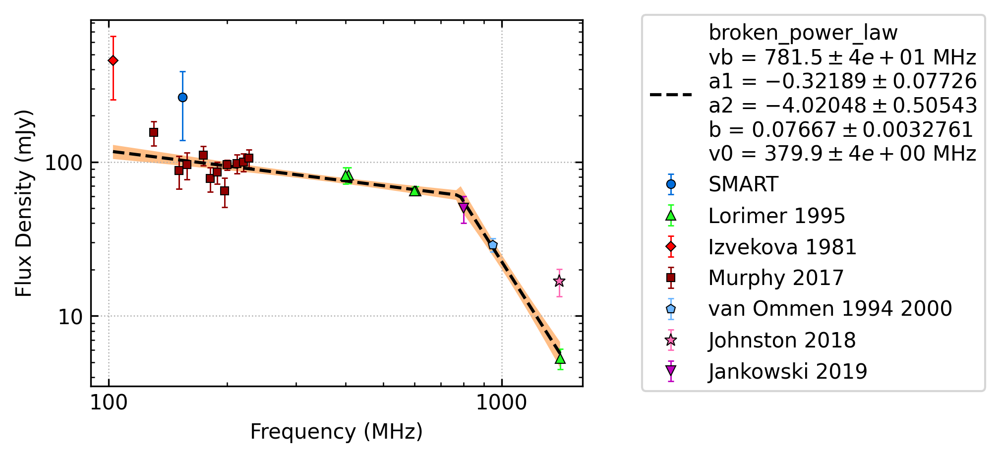
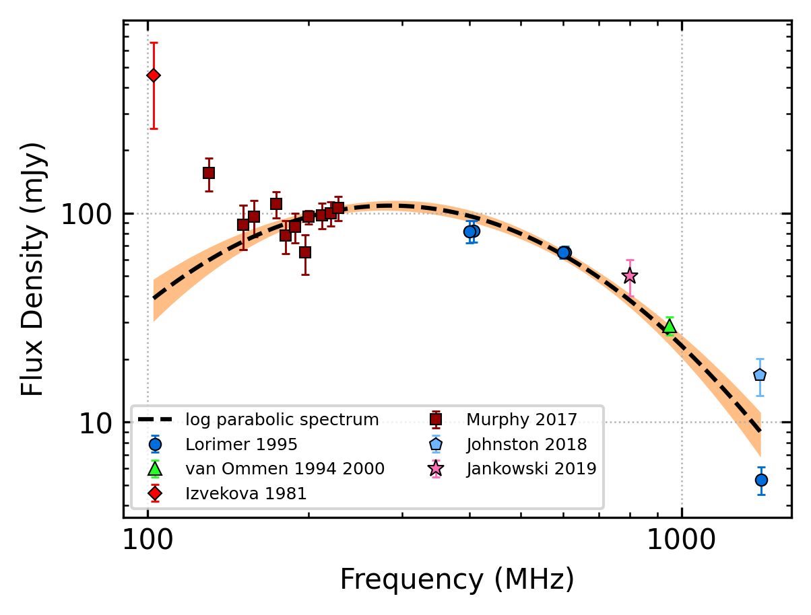
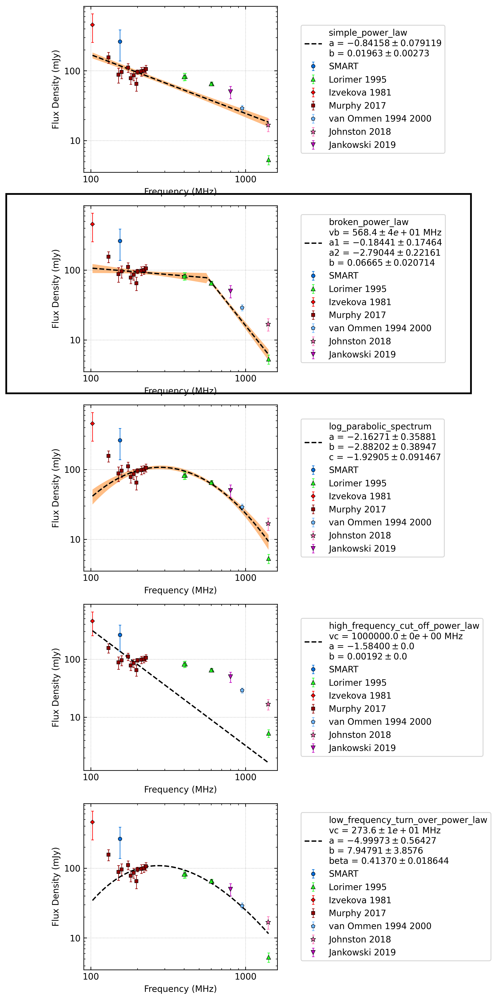
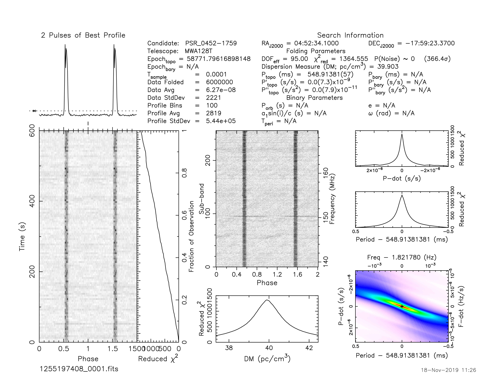
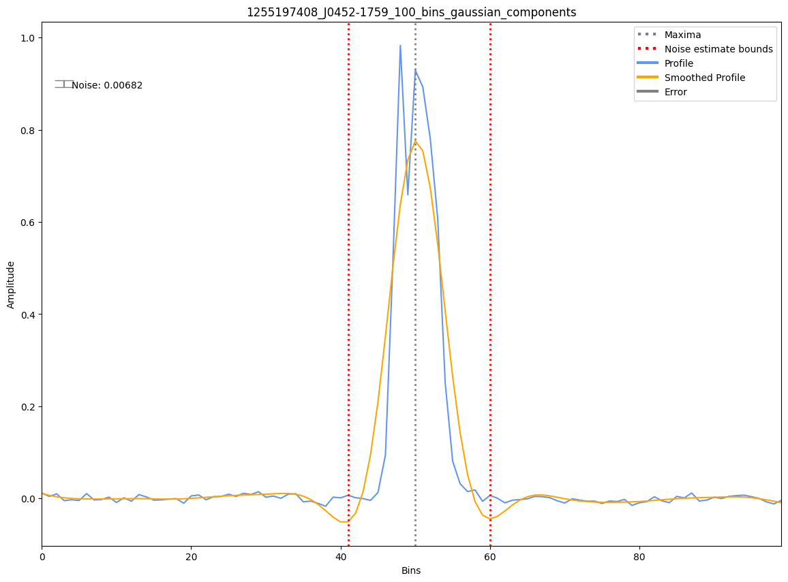
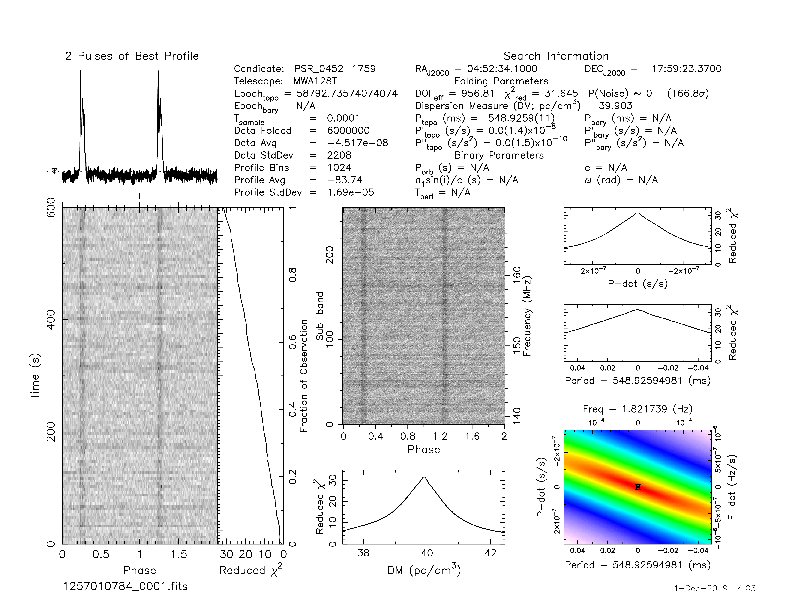
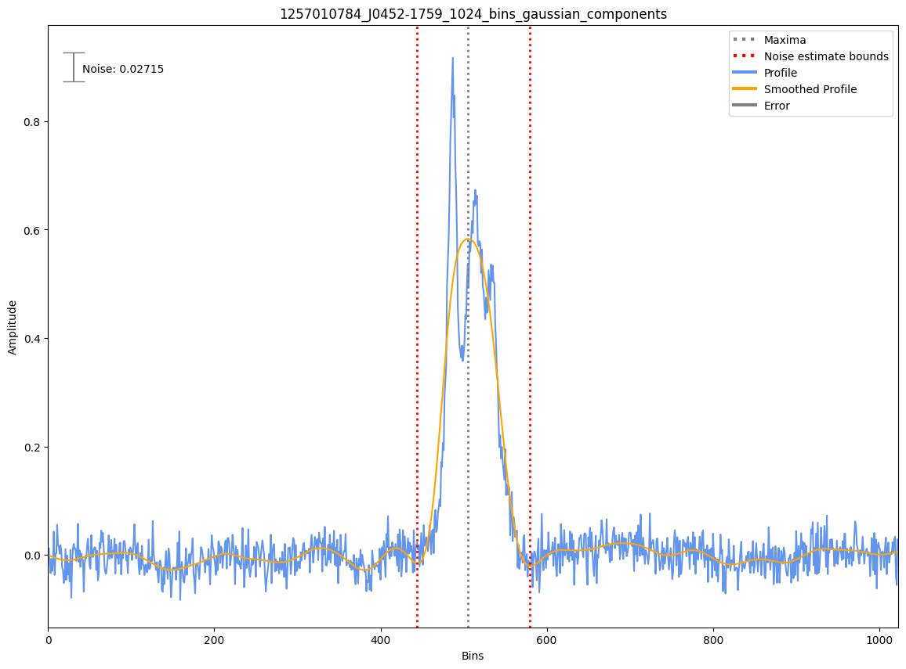
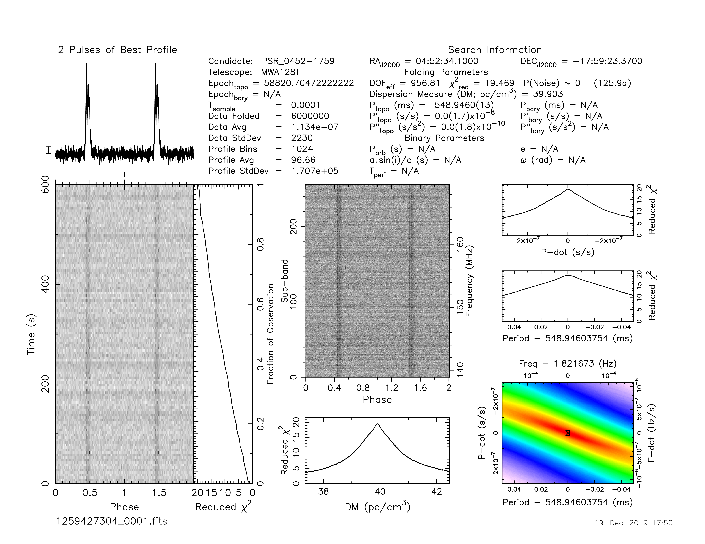

.. _J0452-1759:
J0452-1759
==========

Best Fit
--------

.. csv-table:: J0452-1759 fit results
   :header: "model","vb (MHz)","a1","a2","b"

   "broken_power_law","783±33","-0.33±0.06","-4.04±0.41","0.05±0.00"

Fit Before MWA
--------------

.. csv-table:: J0452-1759 before fit results
   :header: "model","a","b","c"

   "log_parabolic_spectrum","-2.25±0.36","-2.97±0.39","-1.94±0.09"

Flux Density Results
--------------------
.. csv-table:: J0452-1759 flux density total results
   :header: "N obs", "Flux Density (mJy)", "u_S_mean", "u_scint", "m_r_v"

   "3",  "224.4±105.8", "79.4", "100.5", "0.448"

.. csv-table:: J0452-1759 flux density individual results
   :header: "ObsID", "Flux Density (mJy)"

    "1255197408", "358.2±77.5"
    "1257010784", "159.1±12.3"
    "1259427304", "155.9±11.8"

Comparison Fit
--------------

Detection Plots
---------------

.. image:: on_pulse_plots/1259427304_J0452-1759_1024_bins_gaussian_components.png
  :width: 800