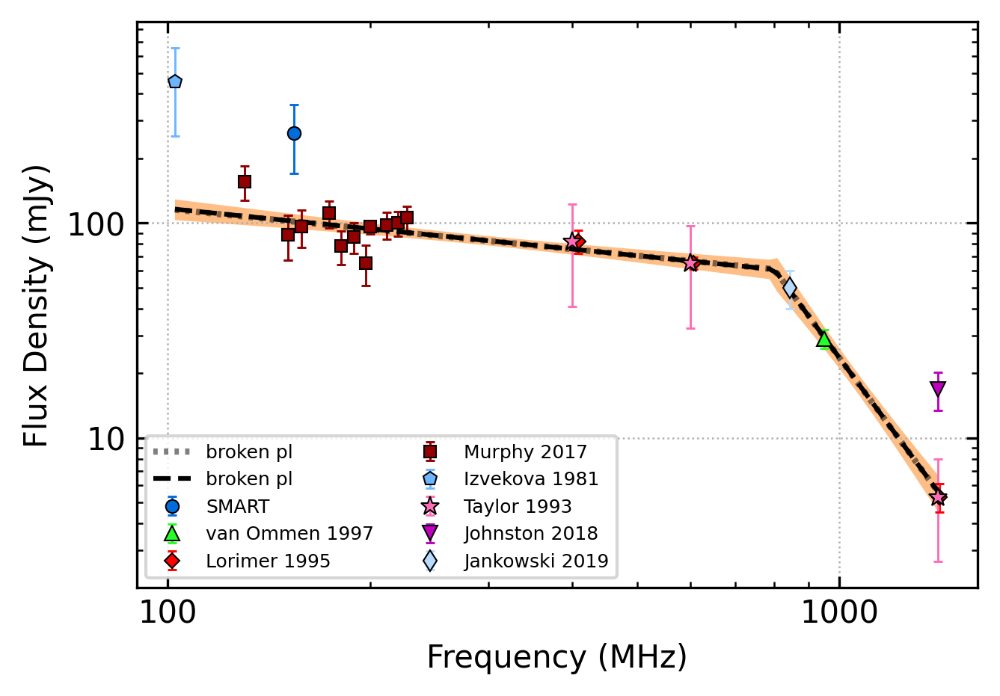
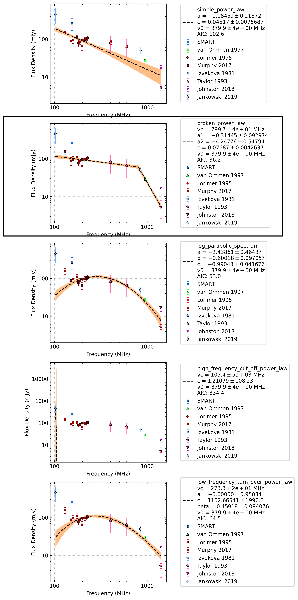

.. _J0452-1759:
J0452-1759
==========

Best Fit
--------

.. csv-table:: J0452-1759 fit results
   :header: "model","a","b","c","v0 (MHz)"

   "log_parabolic_spectrum","-2.16±0.36","-0.57±0.07","-1.01±0.03","379±3"

Fit Before MWA
--------------

.. csv-table:: J0452-1759 before fit results
   :header: "model","a","b","c","v0 (MHz)"

   "log_parabolic_spectrum","-2.18±0.39","-0.57±0.07","-1.01±0.03","379±3"

Flux Density Results
--------------------
.. csv-table:: J0452-1759 flux density total results
   :header: "N obs", "Flux Density (mJy)", "u_S_mean", "u_scint", "m_r_v"

   "3",  "262.8±124.4", "93.2", "117.7", "0.448"

.. csv-table:: J0452-1759 flux density individual results
   :header: "ObsID", "Flux Density (mJy)"

    "1255197408", "420.8±91.0"
    "1257010784", "186.1±14.4"
    "1259427304", "181.6±13.7"

Comparison Fit
--------------

Detection Plots
---------------

.. image:: detection_plots/1255197408_J0452-1759.prepfold.png
  :width: 800

.. image:: on_pulse_plots/1255197408_J0452-1759_100_bins_gaussian_components.png
  :width: 800
.. image:: detection_plots/1257010784_J0452-1759.prepfold.png
  :width: 800

.. image:: on_pulse_plots/1259427304_J0452-1759_1024_bins_gaussian_components.png
  :width: 800