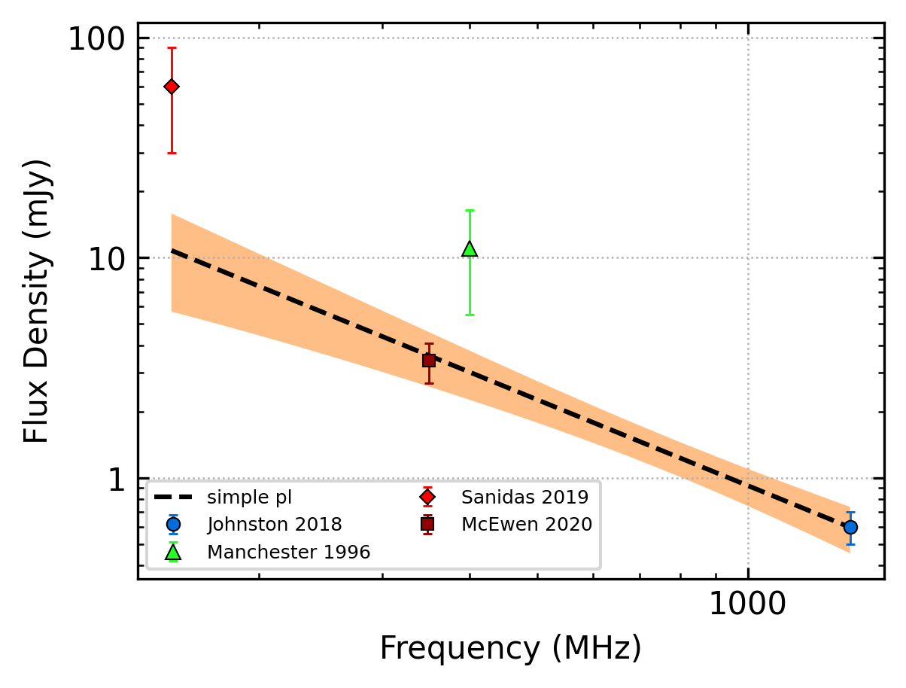
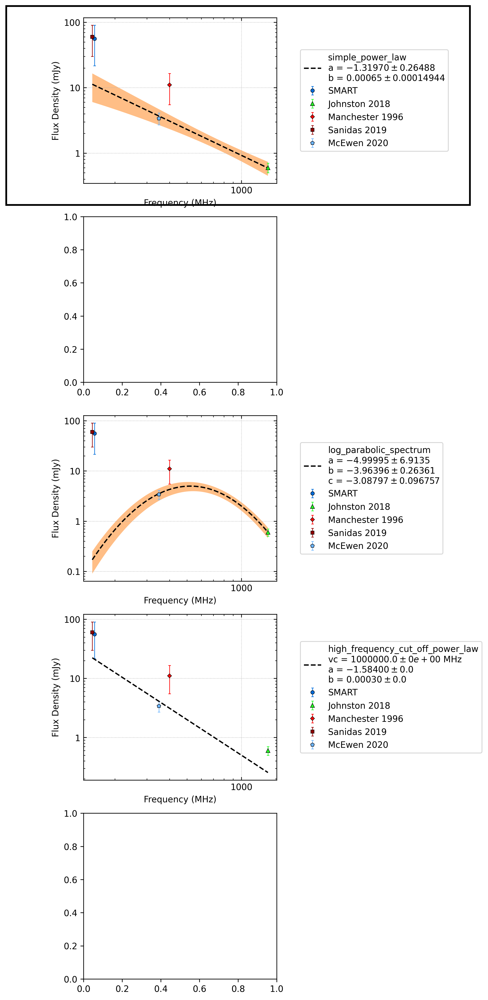
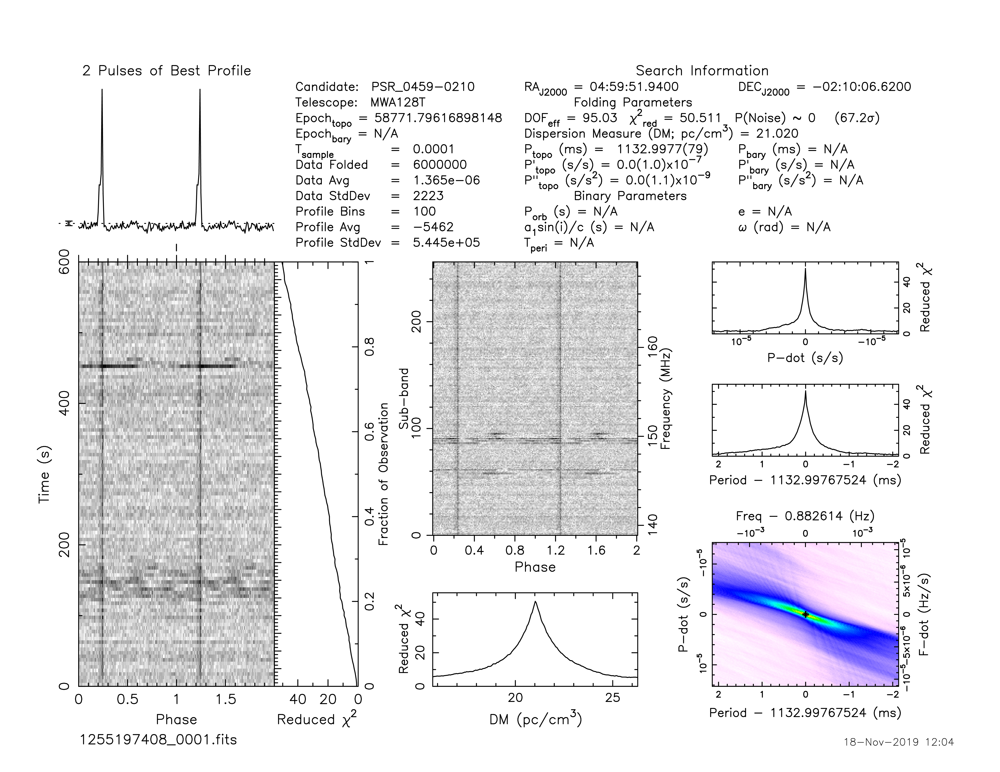
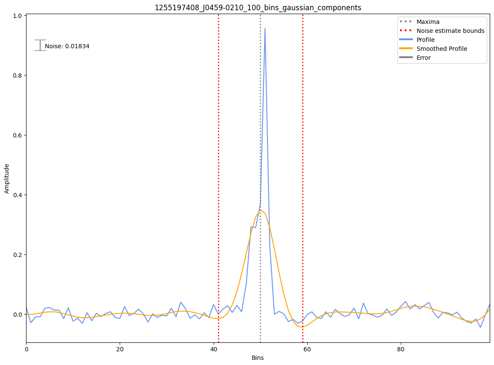
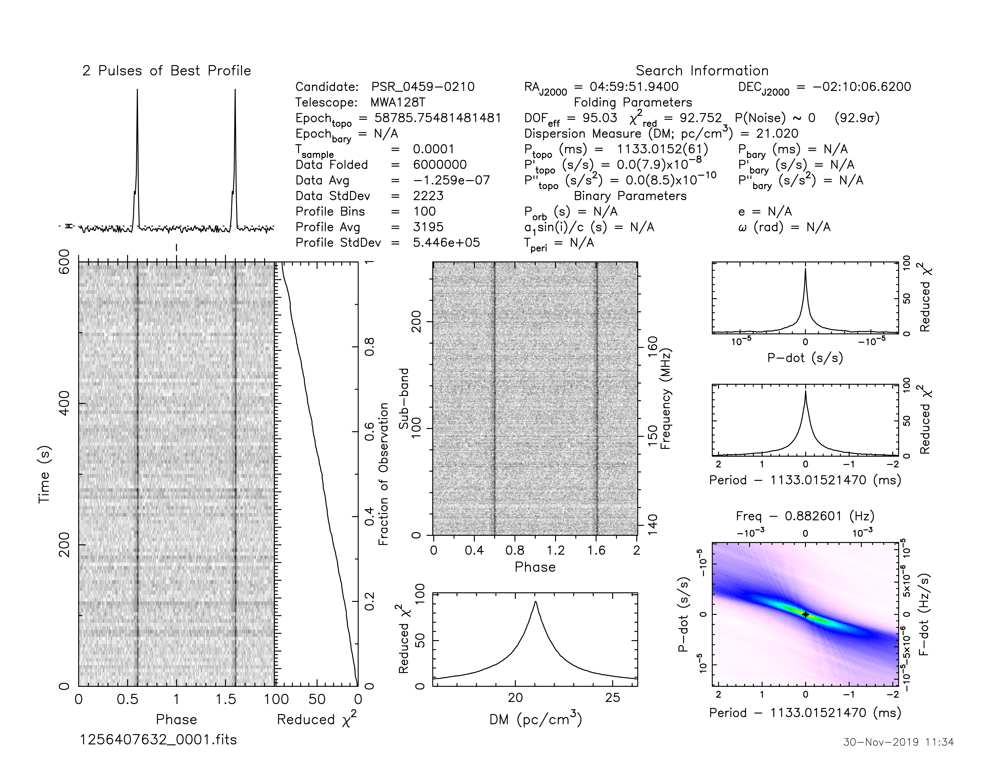
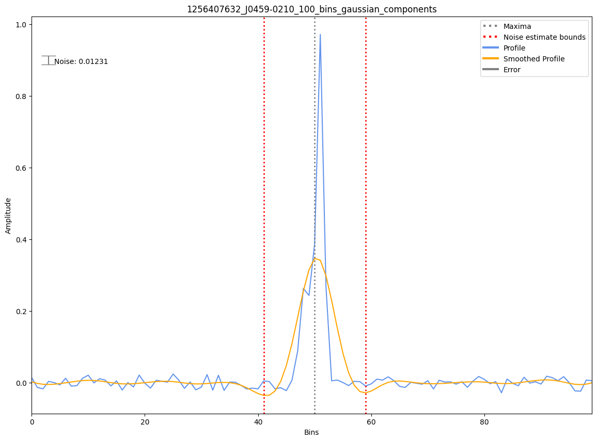
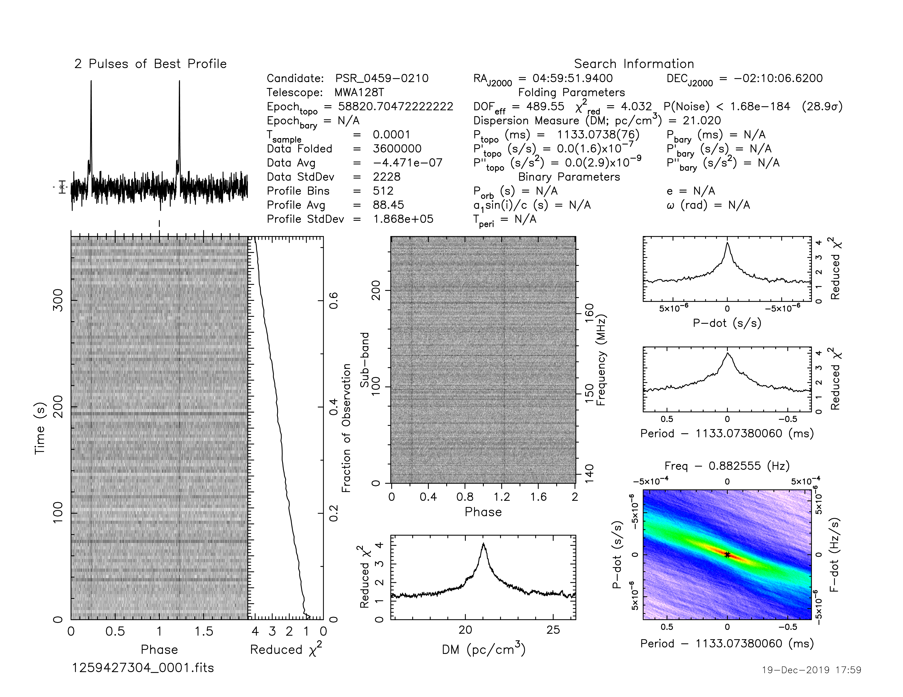
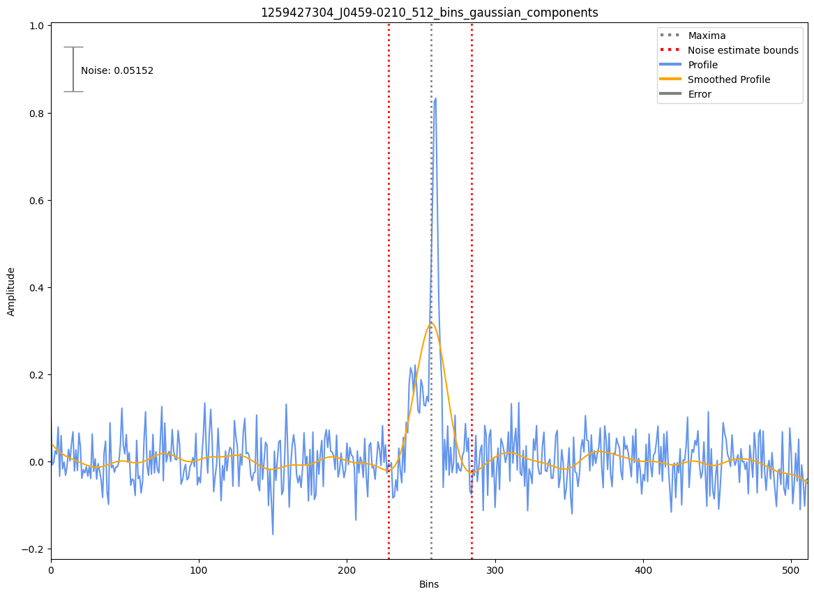

.. _J0459-0210:
J0459-0210
==========

Best Fit
--------
.. image:: best_fits/J0459-0210_simple_power_law_fit.png
  :width: 800

.. csv-table:: J0459-0210 fit results
   :header: "model","a","b"

   "simple_power_law","-1.32±0.26","0.00±0.00"

Fit Before MWA
--------------

.. csv-table:: J0459-0210 before fit results
   :header: "model","a","b"

   "simple_power_law","-1.30±0.27","0.00±0.00"

Flux Density Results
--------------------
.. csv-table:: J0459-0210 flux density total results
   :header: "N obs", "Flux Density (mJy)", "u_S_mean", "u_scint", "m_r_v"

   "3",  "55.9±34.3", "29.7", "33.9", "0.605"

.. csv-table:: J0459-0210 flux density individual results
   :header: "ObsID", "Flux Density (mJy)"

    "1255197408", "62.2±18.9"
    "1256407632", "68.2±21.8"
    "1259427304", "37.4±7.0"

Comparison Fit
--------------

Detection Plots
---------------

