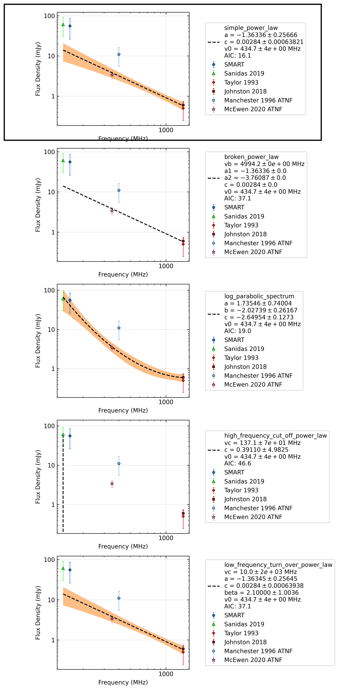

.. _J0459-0210:
J0459-0210
==========

Best Fit
--------
.. image:: best_fits/J0459-0210_simple_power_law_fit.png
  :width: 800

.. csv-table:: J0459-0210 fit results
   :header: "model","a","b"

   "simple_power_law","-1.30±0.19","0.00±0.00"

Fit Before MWA
--------------
.. image:: before_mwa/J0459-0210_simple_power_law_fit.png
  :width: 800

.. csv-table:: J0459-0210 before fit results
   :header: "model","a","b"

   "simple_power_law","-1.28±0.19","0.00±0.00"

Flux Density Results
--------------------
.. csv-table:: J0459-0210 flux density total results
   :header: "N obs", "Flux Density (mJy)", "u_S_mean", "u_scint", "m_r_v"

   "3",  "47.7±29.2", "25.3", "28.9", "0.605"

.. csv-table:: J0459-0210 flux density individual results
   :header: "ObsID", "Flux Density (mJy)"

    "1255197408", "52.9±16.0"
    "1256407632", "58.0±18.6"
    "1259427304", "32.1±6.0"

Comparison Fit
--------------

Detection Plots
---------------

.. image:: detection_plots/1255197408_J0459-0210.prepfold.png
  :width: 800

.. image:: on_pulse_plots/1255197408_J0459-0210_100_bins_gaussian_components.png
  :width: 800

.. image:: detection_plots/1259427304_J0459-0210.prepfold.png
  :width: 800

.. image:: on_pulse_plots/1259427304_J0459-0210_512_bins_gaussian_components.png
  :width: 800