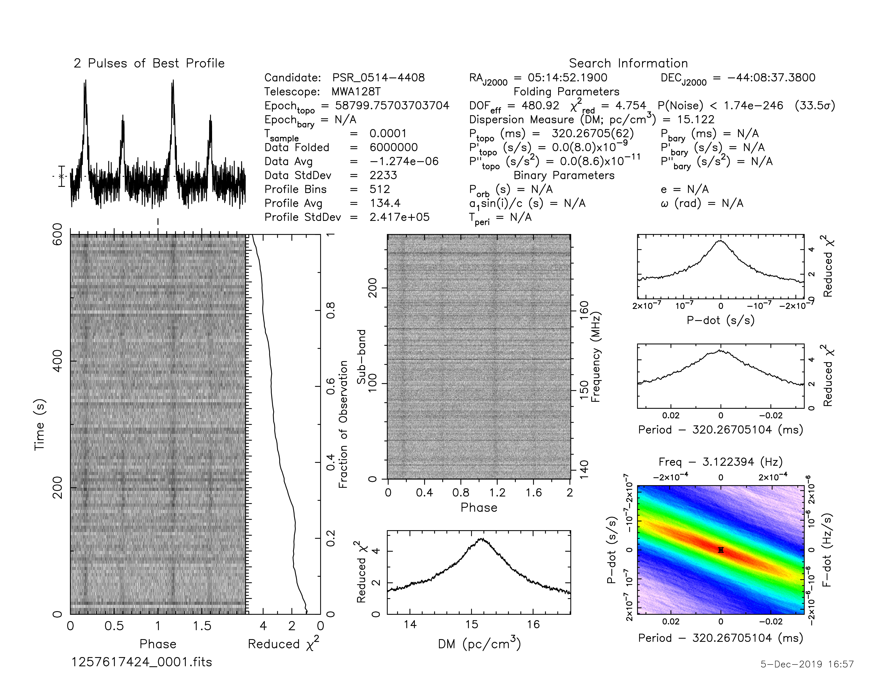
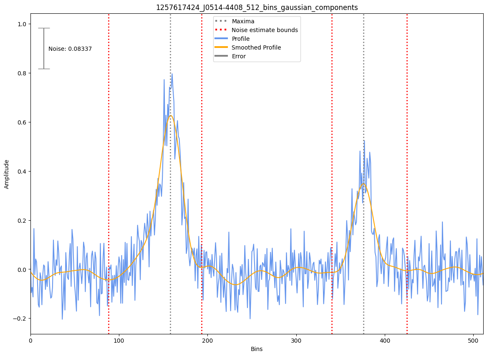

.. _J0514-4408:
J0514-4408
==========

Best Fit
--------
Only 1 MWA data and 1 cat data available

Flux Density Results
--------------------
.. csv-table:: J0514-4408 flux density total results
   :header: "N obs", "Flux Density (mJy)", "u_S_mean", "u_scint", "m_r_v"

   "1",  "77.2±55.0", "6.5", "54.6", "0.707"

.. csv-table:: J0514-4408 flux density individual results
   :header: "ObsID", "Flux Density (mJy)"

    "1257617424", "77.2±6.5"

Detection Plots
---------------

