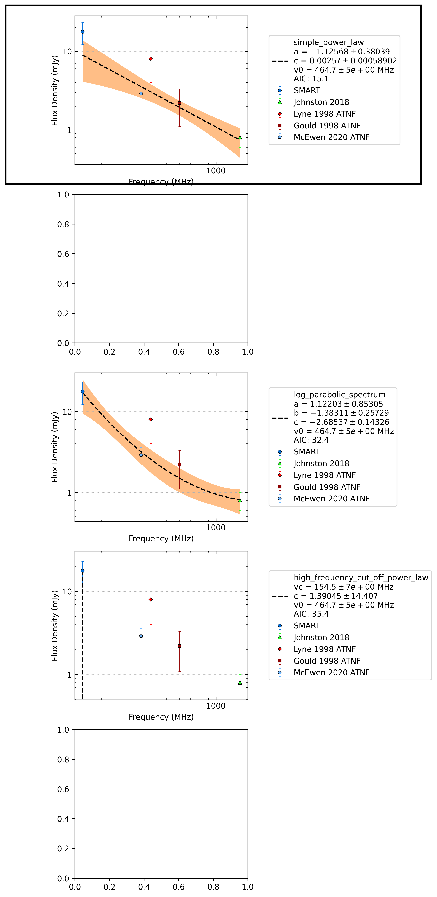

.. _J0520-2553:
J0520-2553
==========

Best Fit
--------
.. image:: best_fits/J0520-2553_simple_power_law_fit.png
  :width: 800

.. csv-table:: J0520-2553 fit results
   :header: "model","a","b"

   "simple_power_law","-1.00±0.25","0.00±0.00"

Fit Before MWA
--------------
.. image:: before_mwa/J0520-2553_simple_power_law_fit.png
  :width: 800

.. csv-table:: J0520-2553 before fit results
   :header: "model","a","b"

   "simple_power_law","-0.95±0.24","0.00±0.00"

Flux Density Results
--------------------
.. csv-table:: J0520-2553 flux density total results
   :header: "N obs", "Flux Density (mJy)", "u_S_mean", "u_scint", "m_r_v"

   "1",  "15.1±8.7", "4.6", "7.3", "0.485"

.. csv-table:: J0520-2553 flux density individual results
   :header: "ObsID", "Flux Density (mJy)"

    "1257010784", "15.1±4.6"

Comparison Fit
--------------

Detection Plots
---------------

.. image:: on_pulse_plots/1257010784_J0520-2553_128_bins_gaussian_components.png
  :width: 800