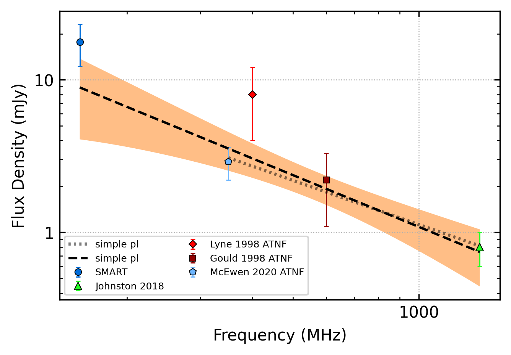

.. _J0520-2553:
J0520-2553
==========

Best Fit
--------

.. csv-table:: J0520-2553 fit results
   :header: "model","a","c","v0 (MHz)"

   "simple_power_law","-1.13±0.38","0.00±0.00","464±4"

Fit Before MWA
--------------

.. csv-table:: J0520-2553 before fit results
   :header: "model","a","c","v0 (MHz)"

   "simple_power_law","-0.98±0.34","0.00±0.00","689±6"

Flux Density Results
--------------------
.. csv-table:: J0520-2553 flux density total results
   :header: "N obs", "Flux Density (mJy)", "u_S_mean", "u_scint", "m_r_v"

   "1",  "17.7±10.1", "5.4", "8.6", "0.485"

.. csv-table:: J0520-2553 flux density individual results
   :header: "ObsID", "Flux Density (mJy)"

    "1257010784", "17.7±5.4"

Comparison Fit
--------------
.. image:: comparison_fits/J0520-2553_comparison_fit.png
  :width: 800

Detection Plots
---------------

.. image:: detection_plots/1257010784_J0520-2553.prepfold.png
  :width: 800

