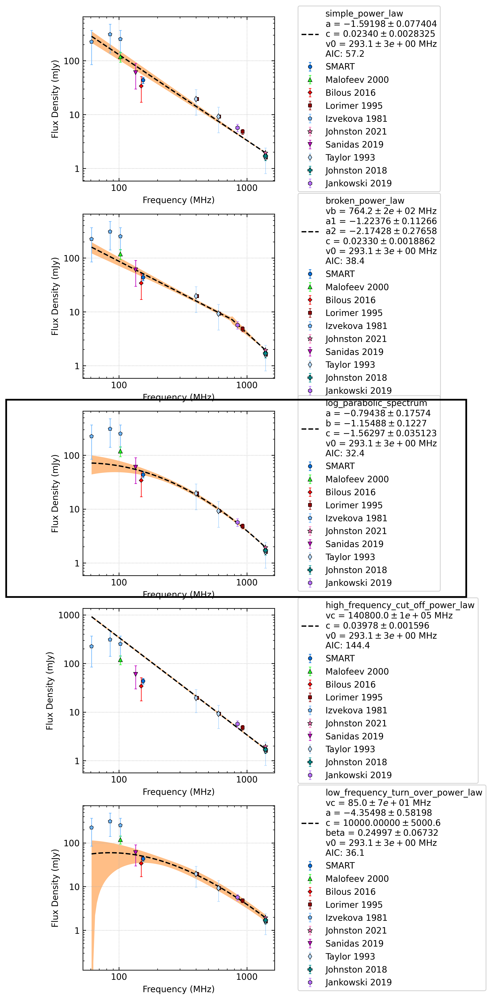

.. _J0525+1115:
J0525+1115
==========

Best Fit
--------

.. csv-table:: J0525+1115 fit results
   :header: "model","a","b","c","v0 (MHz)"

   "log_parabolic_spectrum","-0.46±0.16","-1.46±0.13","-1.51±0.03","293±2"

Fit Before MWA
--------------

.. csv-table:: J0525+1115 before fit results
   :header: "model","a","b","c","v0 (MHz)"

   "log_parabolic_spectrum","-0.41±0.14","-1.52±0.11","-1.50±0.03","293±2"

Flux Density Results
--------------------
.. csv-table:: J0525+1115 flux density total results
   :header: "N obs", "Flux Density (mJy)", "u_S_mean", "u_scint", "m_r_v"

   "1",  "43.7±15.2", "5.5", "14.2", "0.324"

.. csv-table:: J0525+1115 flux density individual results
   :header: "ObsID", "Flux Density (mJy)"

    "1259685792", "43.7±5.5"

Comparison Fit
--------------

Detection Plots
---------------

.. image:: detection_plots/pf_1259685792_J0525+1115_05:25:56.44_+11:15:19.08_b1024_354.44ms_Cand.pfd.png
  :width: 800

.. image:: on_pulse_plots/1259685792_J0525+1115_512_bins_gaussian_components.png
  :width: 800