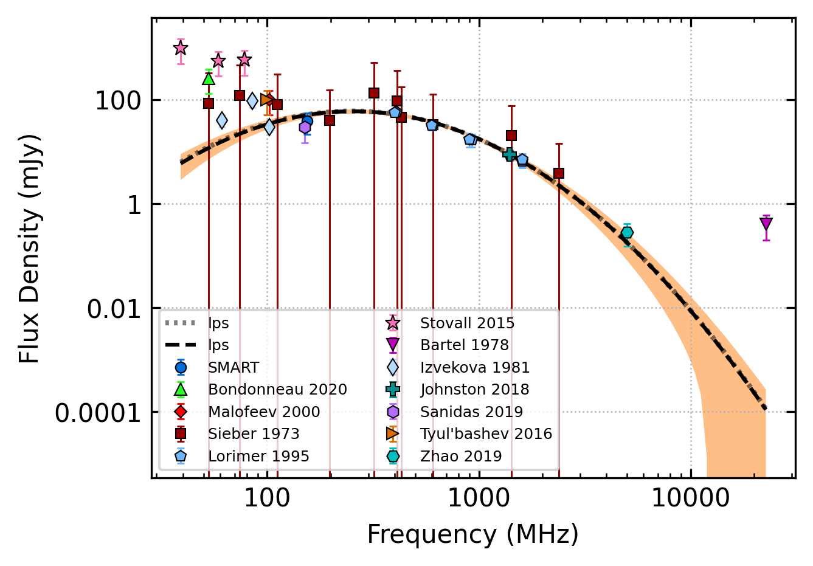
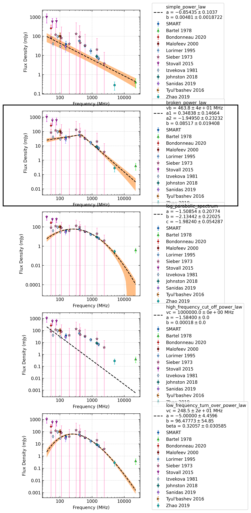

.. _J0528+2200:
J0528+2200
==========

Best Fit
--------

.. csv-table:: J0528+2200 fit results
   :header: "model","a","b","c","v0 (MHz)"

   "log_parabolic_spectrum","-1.43±0.27","-1.61±0.19","-1.72±0.06","940±9"

Fit Before MWA
--------------

.. csv-table:: J0528+2200 before fit results
   :header: "model","a","b","c","v0 (MHz)"

   "log_parabolic_spectrum","-1.45±0.21","-1.67±0.17","-1.71±0.04","940±9"

Flux Density Results
--------------------
.. csv-table:: J0528+2200 flux density total results
   :header: "N obs", "Flux Density (mJy)", "u_S_mean", "u_scint", "m_r_v"

   "1",  "38.3±16.8", "6.9", "15.3", "0.400"

.. csv-table:: J0528+2200 flux density individual results
   :header: "ObsID", "Flux Density (mJy)"

    "1259685792", "38.3±6.9"

Comparison Fit
--------------

Detection Plots
---------------

.. image:: detection_plots/pf_1259685792_J0528+2200_05:28:52.26_+22:00:04.00_b1024_3744.90ms_Cand.pfd.png
  :width: 800

.. image:: on_pulse_plots/1259685792_J0528+2200_512_bins_gaussian_components.png
  :width: 800