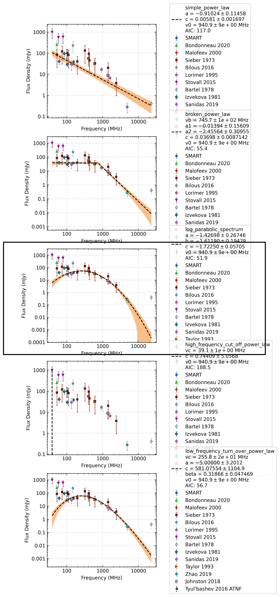

J0528+2200
==========

Best Fit
--------
.. image:: best_fits/J0528+2200_simple_power_law_fit.png
  :width: 800

.. csv-table:: J0528+2200 fit results
   :header: "model","a","b"

   "simple_power_law","-1.00±0.25","0.00±0.00"

Fit Before MWA
--------------
.. image:: before_mwa/J0528+2200_log_parabolic_spectrum_fit.png
  :width: 800

.. csv-table:: J0528+2200 before fit results
   :header: "model","a","b","c"

   "log_parabolic_spectrum","-1.46±0.24","-2.11±0.22","-1.98±0.04"

Flux Density Results
--------------------
.. csv-table:: J0528+2200 flux density total results
   :header: "N obs", "Flux Density (mJy)", " u_S_mean", "u_scint", "m_r_v"

   "0",  "15.1±8.7", "4.6", "7.3", "0.485"

.. csv-table:: J0528+2200 flux density individual results
   :header: "ObsID", "Flux Density (mJy)"

    "1259685792", "nan±nan"

Comparison Fit
--------------

Detection Plots
---------------
