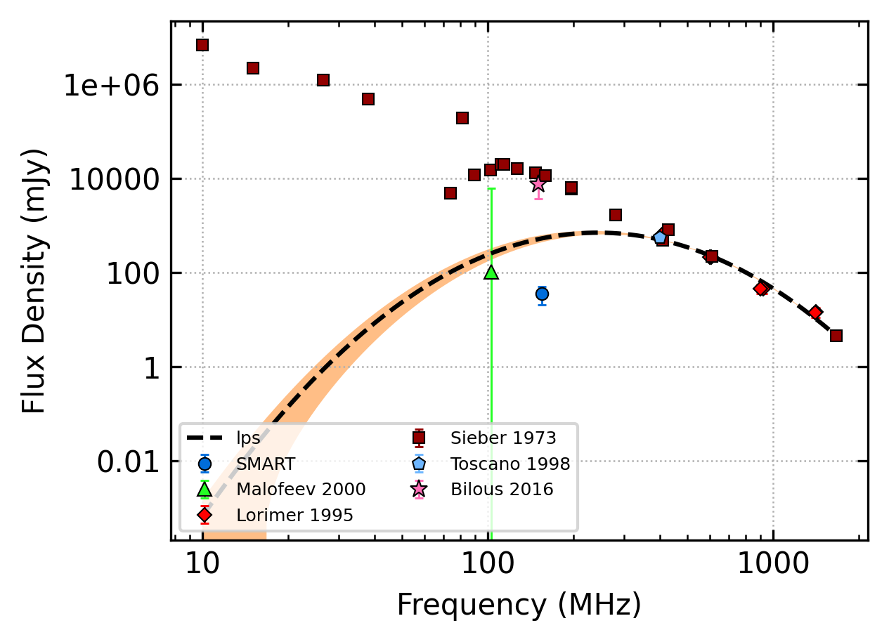
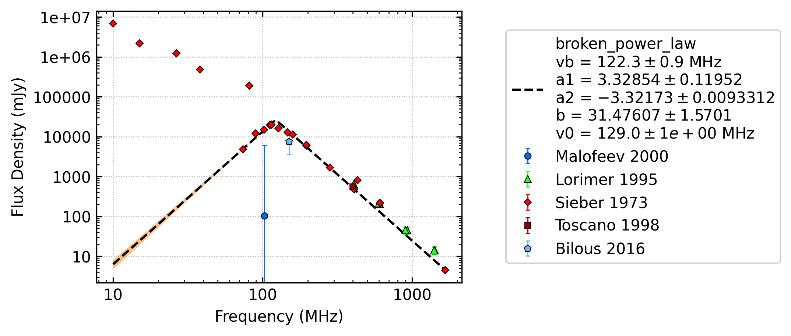

.. _J0534+2200:
J0534+2200
==========

Best Fit
--------

.. csv-table:: J0534+2200 fit results
   :header: "model","a","b","c","v0 (MHz)"

   "log_parabolic_spectrum","-3.14±0.17","1.72±0.29","-0.39±0.11","128±1"

Fit Before MWA
--------------

.. csv-table:: J0534+2200 before fit results
   :header: "model","vb (MHz)","a1","a2","b","v0 (MHz)"

   "broken_power_law","122±0","3.33±0.12","-3.32±0.01","31.48±1.57","128±1"

Flux Density Results
--------------------
.. csv-table:: J0534+2200 flux density total results
   :header: "N obs", "Flux Density (mJy)", "u_S_mean", "u_scint", "m_r_v"

   "1",  "35.0±14.8", "6.5", "13.3", "0.380"

.. csv-table:: J0534+2200 flux density individual results
   :header: "ObsID", "Flux Density (mJy)"

    "1259685792", "35.0±6.5"

Comparison Fit
--------------
.. image:: comparison_fits/J0534+2200_comparison_fit.png
  :width: 800

Detection Plots
---------------

.. image:: detection_plots/pf_1259685792_J0534+2200_05:34:31.97_+22:00:52.06_b100_33.39ms_Cand.pfd.png
  :width: 800

.. image:: on_pulse_plots/1259685792_J0534+2200_100_bins_gaussian_components.png
  :width: 800