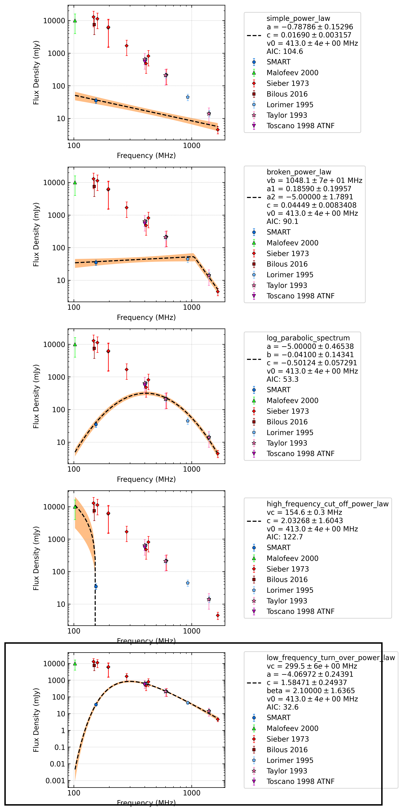

.. _J0534+2200:
J0534+2200
==========

Best Fit
--------

.. csv-table:: J0534+2200 fit results
   :header: "model","vc (MHz)","a","c","beta","v0 (MHz)"

   "low_frequency_turn_over_power_law","299±5","-4.07±0.24","1.58±0.25","2.10±1.64","412±4"

Fit Before MWA
--------------

.. csv-table:: J0534+2200 before fit results
   :header: "model","vpeak (MHz)","a","c","beta","v0 (MHz)"

   "log_parabolic_spectrum","-0.96±0.36","-2.81±0.18","-0.22±0.05","412±4"

Flux Density Results
--------------------
.. csv-table:: J0534+2200 flux density total results
   :header: "N obs", "Flux Density (mJy)", "u_S_mean", "u_scint", "m_r_v"

   "1",  "35.0±14.8", "6.5", "13.3", "0.380"

.. csv-table:: J0534+2200 flux density individual results
   :header: "ObsID", "Flux Density (mJy)"

    "1259685792", "35.0±6.5"

Comparison Fit
--------------

Detection Plots
---------------

.. image:: detection_plots/pf_1259685792_J0534+2200_05:34:31.97_+22:00:52.06_b100_33.39ms_Cand.pfd.png
  :width: 800

.. image:: on_pulse_plots/1259685792_J0534+2200_100_bins_gaussian_components.png
  :width: 800