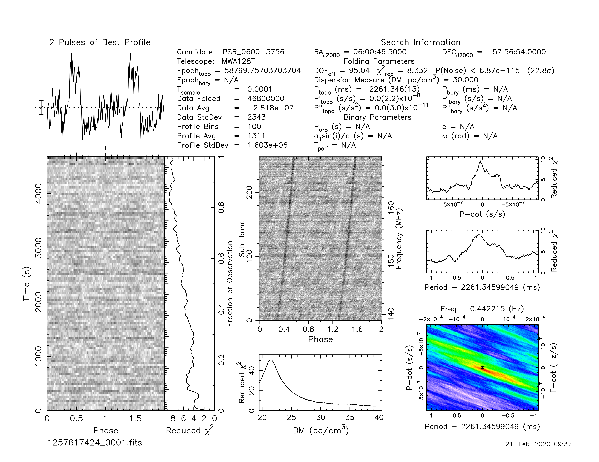
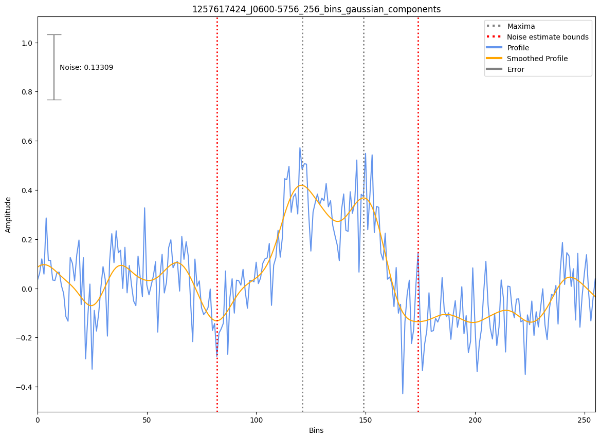

.. _J0600-5756:
J0600-5756
==========

Best Fit
--------
Only 1 MWA data and 1 cat data available

Flux Density Results
--------------------
.. csv-table:: J0600-5756 flux density total results
   :header: "N obs", "Flux Density (mJy)", "u_S_mean", "u_scint", "m_r_v"

   "1",  "23.4±12.2", "2.5", "12.0", "0.512"

.. csv-table:: J0600-5756 flux density individual results
   :header: "ObsID", "Flux Density (mJy)"

    "1257617424", "23.4±2.5"

Detection Plots
---------------

