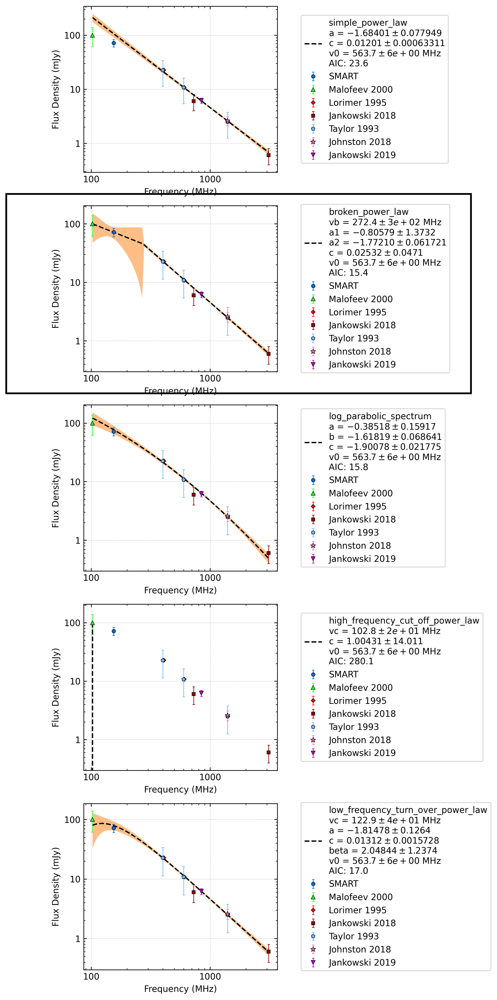

.. _J0601-0527:
J0601-0527
==========

Best Fit
--------
.. image:: best_fits/J0601-0527_log_parabolic_spectrum_fit.png
  :width: 800

.. csv-table:: J0601-0527 fit results
   :header: "model","a","b","c"

   "log_parabolic_spectrum","-0.33±0.18","-1.88±0.12","-2.54±0.02"

Fit Before MWA
--------------
.. image:: before_mwa/J0601-0527_simple_power_law_fit.png
  :width: 800

.. csv-table:: J0601-0527 before fit results
   :header: "model","a","b"

   "simple_power_law","-1.74±0.06","0.00±0.00"

Flux Density Results
--------------------
.. csv-table:: J0601-0527 flux density total results
   :header: "N obs", "Flux Density (mJy)", "u_S_mean", "u_scint", "m_r_v"

   "1",  "71.9±25.9", "11.5", "23.2", "0.322"

.. csv-table:: J0601-0527 flux density individual results
   :header: "ObsID", "Flux Density (mJy)"

    "1259427304", "71.9±11.5"

Comparison Fit
--------------

Detection Plots
---------------

.. image:: detection_plots/1259427304_J0601-0527.prepfold.png
  :width: 800

.. image:: on_pulse_plots/1259427304_J0601-0527_128_bins_gaussian_components.png
  :width: 800