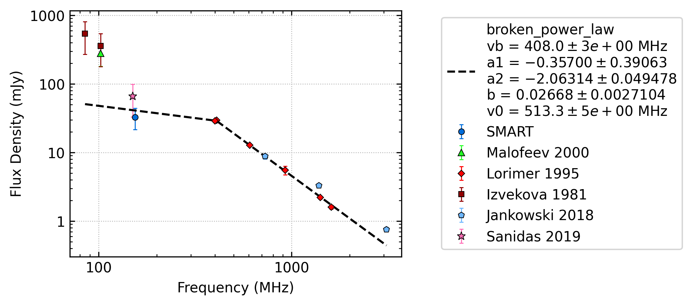

.. _J0614+2229:
J0614+2229
==========

Best Fit
--------

.. csv-table:: J0614+2229 fit results
   :header: "model","vb (MHz)","a1","a2","b","v0 (MHz)"

   "broken_power_law","408±2","-0.36±0.39","-2.06±0.05","0.03±0.00","513±5"

Fit Before MWA
--------------
.. image:: before_mwa/J0614+2229_broken_power_law_fit.png
  :width: 800

.. csv-table:: J0614+2229 before fit results
   :header: "model","vb (MHz)","a1","a2","b","v0 (MHz)"

   "broken_power_law","409±49","-1.42±0.45","-2.06±0.08","0.02±0.00","513±5"

Flux Density Results
--------------------
.. csv-table:: J0614+2229 flux density total results
   :header: "N obs", "Flux Density (mJy)", "u_S_mean", "u_scint", "m_r_v"

   "1",  "32.7±11.2", "5.7", "9.7", "0.295"

.. csv-table:: J0614+2229 flux density individual results
   :header: "ObsID", "Flux Density (mJy)"

    "1259685792", "32.7±5.7"

Comparison Fit
--------------
.. image:: comparison_fits/J0614+2229_comparison_fit.png
  :width: 800

Detection Plots
---------------

.. image:: detection_plots/pf_1259685792_J0614+2229_06:14:17.00_+22:29:56.84_b1024_335.02ms_Cand.pfd.png
  :width: 800

.. image:: on_pulse_plots/1259685792_J0614+2229_256_bins_gaussian_components.png
  :width: 800