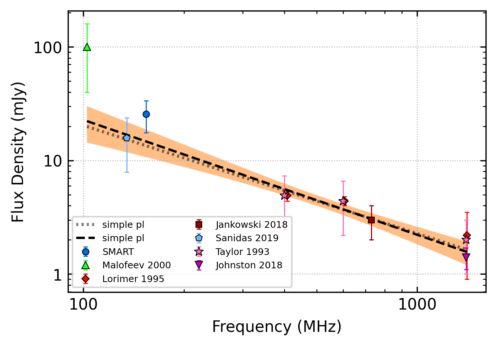

.. _J0624-0424:
J0624-0424
==========

Best Fit
--------

.. csv-table:: J0624-0424 fit results
   :header: "model","a","c","v0 (MHz)"

   "simple_power_law","-1.02±0.20","0.01±0.00","379±3"

Fit Before MWA
--------------

.. csv-table:: J0624-0424 before fit results
   :header: "model","a","c","v0 (MHz)"

   "simple_power_law","-0.95±0.20","0.01±0.00","379±3"

Flux Density Results
--------------------
.. csv-table:: J0624-0424 flux density total results
   :header: "N obs", "Flux Density (mJy)", "u_S_mean", "u_scint", "m_r_v"

   "1",  "25.5±11.8", "8.0", "8.7", "0.342"

.. csv-table:: J0624-0424 flux density individual results
   :header: "ObsID", "Flux Density (mJy)"

    "1260638120", "25.5±8.0"

Comparison Fit
--------------
.. image:: comparison_fits/J0624-0424_comparison_fit.png
  :width: 800

Detection Plots
---------------

.. image:: on_pulse_plots/1260638120_J0624-0424_128_bins_gaussian_components.png
  :width: 800