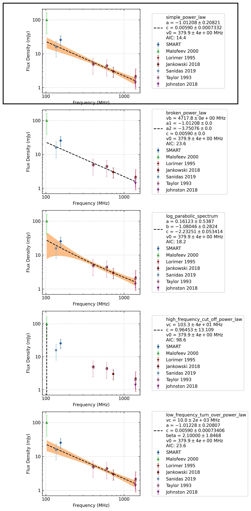

.. _J0624-0424:
J0624-0424
==========

Best Fit
--------
.. image:: best_fits/J0624-0424_simple_power_law_fit.png
  :width: 800

.. csv-table:: J0624-0424 fit results
   :header: "model","a","b"

   "simple_power_law","-1.03±0.18","0.00±0.00"

Fit Before MWA
--------------
.. image:: before_mwa/J0624-0424_simple_power_law_fit.png
  :width: 800

.. csv-table:: J0624-0424 before fit results
   :header: "model","a","b"

   "simple_power_law","-0.99±0.19","0.00±0.00"

Flux Density Results
--------------------
.. csv-table:: J0624-0424 flux density total results
   :header: "N obs", "Flux Density (mJy)", "u_S_mean", "u_scint", "m_r_v"

   "1",  "23.1±10.7", "7.2", "7.9", "0.342"

.. csv-table:: J0624-0424 flux density individual results
   :header: "ObsID", "Flux Density (mJy)"

    "1260638120", "23.1±7.2"

Comparison Fit
--------------

Detection Plots
---------------

.. image:: detection_plots/1260638120_J0624-0424.prepfold.png
  :width: 800

.. image:: on_pulse_plots/1260638120_J0624-0424_128_bins_gaussian_components.png
  :width: 800