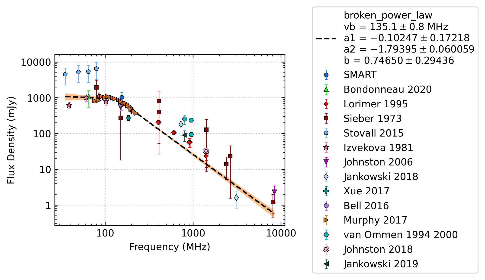
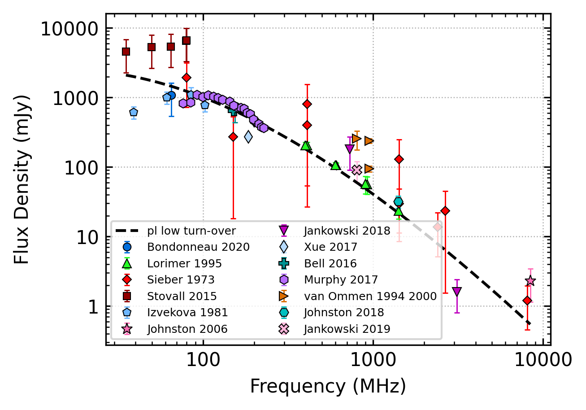

.. _J0630-2834:
J0630-2834
==========

Best Fit
--------

.. csv-table:: J0630-2834 fit results
   :header: "model","vb (MHz)","a1","a2","b"

   "broken_power_law","135±0","-0.10±0.17","-1.79±0.06","0.75±0.29"

Fit Before MWA
--------------

.. csv-table:: J0630-2834 before fit results
   :header: "model","vc (MHz)","a","b","beta"

   "low_frequency_turn_over_power_law","16±0","-3.14±0.08","15.22±2.00","0.20±0.00"

Flux Density Results
--------------------
.. csv-table:: J0630-2834 flux density total results
   :header: "N obs", "Flux Density (mJy)", "u_S_mean", "u_scint", "m_r_v"

   "2",  "1041.9±389.3", "102.9", "500.3", "0.480"

.. csv-table:: J0630-2834 flux density individual results
   :header: "ObsID", "Flux Density (mJy)"

    "1258221008", "730.6±47.2"
    "1261241272", "1353.2±91.4"

Comparison Fit
--------------
.. image:: comparison_fits/J0630-2834_comparison_fit.png
  :width: 800

Detection Plots
---------------

.. image:: detection_plots/1258221008_J0630-2834.prepfold.png
  :width: 800

.. image:: on_pulse_plots/1258221008_J0630-2834_1024_bins_gaussian_components.png
  :width: 800
.. image:: detection_plots/1261241272_J0630-2834.prepfold.png
  :width: 800

.. image:: on_pulse_plots/1261241272_J0630-2834_1024_bins_gaussian_components.png
  :width: 800