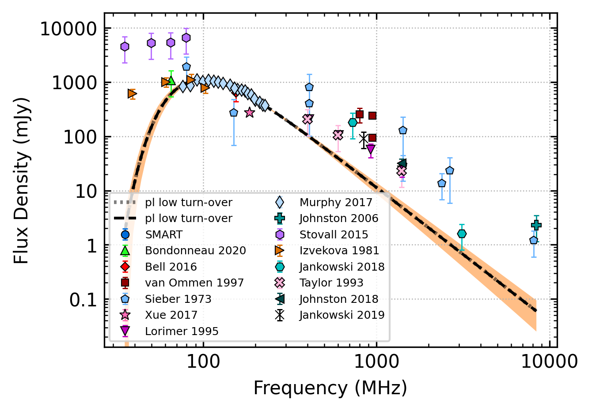

.. _J0630-2834:
J0630-2834
==========

Best Fit
--------

.. csv-table:: J0630-2834 fit results
   :header: "model","vc (MHz)","a","b","beta","v0 (MHz)"

   "low_frequency_turn_over_power_law","70±4","-1.66±0.09","0.10±0.01","2.10±0.33","542±5"

Fit Before MWA
--------------

.. csv-table:: J0630-2834 before fit results
   :header: "model","vc (MHz)","a","b","beta","v0 (MHz)"

   "low_frequency_turn_over_power_law","70±4","-1.66±0.09","0.10±0.01","2.10±0.33","542±5"

Flux Density Results
--------------------
.. csv-table:: J0630-2834 flux density total results
   :header: "N obs", "Flux Density (mJy)", "u_S_mean", "u_scint", "m_r_v"

   "3",  "753.0±367.2", "105.8", "361.6", "0.480"

.. csv-table:: J0630-2834 flux density individual results
   :header: "ObsID", "Flux Density (mJy)"

    "1258221008", "730.6±47.2"
    "1261241272", "1353.2±91.4"
    "1265983624", "175.3±24.8"

Comparison Fit
--------------
.. image:: comparison_fits/J0630-2834_comparison_fit.png
  :width: 800

Detection Plots
---------------

.. image:: detection_plots/1258221008_J0630-2834.prepfold.png
  :width: 800

.. image:: on_pulse_plots/1258221008_J0630-2834_1024_bins_gaussian_components.png
  :width: 800
.. image:: detection_plots/1261241272_J0630-2834.prepfold.png
  :width: 800

.. image:: on_pulse_plots/1261241272_J0630-2834_1024_bins_gaussian_components.png
  :width: 800
.. image:: detection_plots/pf_1265983624_J0630-2834_06:30:49.40_-28:34:42.77_b1024_1244.56ms_Cand.pfd.png
  :width: 800

.. image:: on_pulse_plots/1265983624_J0630-2834_256_bins_gaussian_components.png
  :width: 800